# MagicTunnel

**Smart MCP Proxy** - One intelligent MCP Proxy server that discovers the right MCP for any request. 

Now with **Elicitation and Sampling : MCP 2025-06-18 Integration**, **Multi-Mode Architecture**, and **Modern UI with Unified Status System**

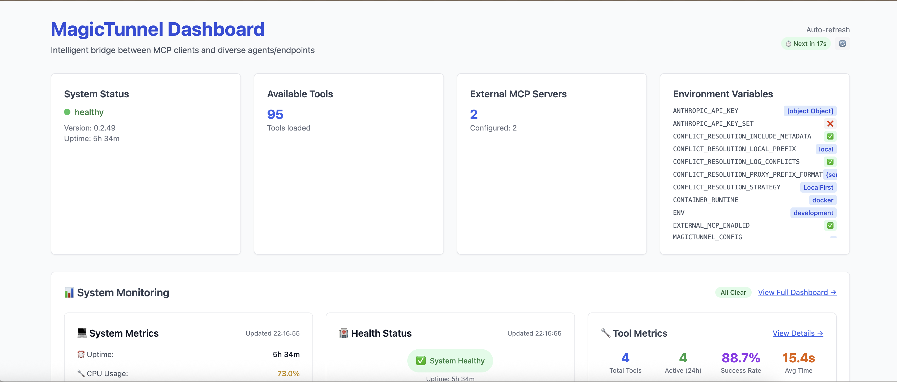

## The Problem
How to seamlessly and securily connect MCP clients to my internal and external systems?

## The Solution  
MagicTunnel provides **one smart tool** that:
1. **⚡ Converts** your internal apis to MCP tools
2. **🔍 Seamlessly** connects MCP clients to both external and internal tools, no limits on number of tools
3. **🔍 Discovers** the right tool for any request, no limits on number of tools
4. **⚡ Executes** the tool with proper parameters, supports elicitationa and sampling, over stdio | HTTP | WebSocket | Streamable HTTP | SSE
5. **🛡️ Protects** execuion and data leaks with Role based access, Audits, Security Policies and Sanitization

## Example Usage

Instead of knowing which specific tool to use:
```json
// ❌ Before: Need to know exact tool names
{"name": "network_ping", "arguments": {"host": "google.com"}}
{"name": "filesystem_read", "arguments": {"path": "/etc/hosts"}}
{"name": "database_query", "arguments": {"sql": "SELECT * FROM users"}}
```

Just describe what you want:
```json
// ✅ After: Natural language requests
{"name": "smart_tool_discovery", "arguments": {"request": "ping google.com"}}
{"name": "smart_tool_discovery", "arguments": {"request": "read the hosts file"}}  
{"name": "smart_tool_discovery", "arguments": {"request": "get all users from database"}}
```


## 🎉 New: Multi-Mode Architecture + Enterprise-Grade Security

**✅ MCP 2025-06-18 Compliant** with sampling/elicitation proxying integration:

- **🧠 Server-side LLM Request Generation**: OpenAI, Anthropic, and Ollama integration for enhanced tool descriptions
- **🔄 Event-driven Enhancement Pipeline**: Real-time tool enhancement with pre-generation at startup
- **🛡️ External MCP Capability Inheritance**: Automatic detection and capability inheritance from external MCP servers
- **⚡ Performance Optimized**: Pre-generated enhancements maintain sub-second response times
- **🔧 CLI Management**: Complete visibility management with MCP capability override warnings
- **📊 Version Management**: Automatic capability file versioning with rollback support

## Quick Start

### 🚀 Simple Setup (Proxy Mode without Dashboard)

```bash
# Clone and build
git clone https://github.com/your-org/magictunnel.git
cd magictunnel
make build-release
```

```bash
# Zero-config startup - just run it
export MAGICTUNNEL_RUNTIME_MODE=proxy && export MAGICTUNNEL_SMART_DISCOVERY=false && ./magictunnel 

# Test the smart discovery
curl -X POST http://localhost:3001/v1/mcp/call \
  -H "Content-Type: application/json" \
  -d '{"name": "ping_globalping", "arguments": {"request": "ping google.com"}}'
```

### 🏢 Full Featured (Advanced Mode with dashboard)
```bash
# Clone and build
git clone https://github.com/your-org/magictunnel.git
cd magictunnel
make build-release-ollama && make pregenerate-embeddings-ollama MAGICTUNNEL_ENV=development
```

```bash
# Run with enterprise features and web dashboard
export MAGICTUNNEL_RUNTIME_MODE=advanced  && ./magictunnel-supervisor 

# Access the web dashboard
cd frontend
npm run dev
open http://localhost:5173/dashboard
```

📚 **[Complete Setup Guide](docs/quickstart.md)** - Detailed installation, configuration options, and tutorials

## 🏗️ Multi-Mode Architecture (v0.3.10)

MagicTunnel supports **two distinct runtime modes** to address different use cases:

### 🚀 Proxy Mode (Default)
**Perfect for**: Quick setup, minimal resource usage, headless operation
- ✅ Core MCP proxy functionality with optional smart discovery
- ✅ Fast startup and low memory footprint
- ✅ Minimum logging

### 🏢 Advanced Mode  
**Perfect for**: Production deployments, enterprise environments
- ✅ All proxy mode features
- ✅ Enterprise security management and RBAC
- ✅ Complete web dashboard with security UI
- ✅ Audit logging and monitoring  

📚 **[Complete Configuration Guide](docs/config.md)** - Full configuration options and examples

## Web Dashboard

Access the comprehensive web dashboard at `http://localhost:5173/dashboard` for:
- 📊 Real-time system monitoring and metrics
- 🔧 Tool management and testing interface  
- 📝 Live logs and configuration editing
- 🔒 Enterprise security management (Advanced Mode)

📚 **[Dashboard Guide](docs/web-dashboard.md)** - Complete web interface documentation

## Add Your Tools

Create `capabilities/my-tools.yaml`:
```yaml
tools:
  - name: "ping"
    description: "Test network connectivity to a host"
    input_schema:
      type: object
      properties:
        host:
          type: string
          description: "Hostname or IP address to ping"
    routing:
      type: "command"
      command: "ping"
      args: ["-c", "4", "{host}"]
```

Or generate from existing APIs:
```bash
# From OpenAPI specs
./target/release/openapi-generator --spec https://api.example.com/openapi.json --output tools.yaml
```

🔧 **[Complete Tools Guide](docs/tools.md)** - Tool creation, API generation, and management

## Features

- 🏗️ **Multi-Mode Architecture**: Proxy mode (minimal setup) and Advanced mode (enterprise features) with environment variable control
- ✨ **Enhanced MCP 2025-06-18 Format**: Latest MCP specification with proxying support for Elicitation and Sampling with AI-enhanced discovery, security sandboxing, and enterprise monitoring
- ✅ **Smart Discovery**: AI-powered tool selection with natural language interface  
- 🖥️ **Web Dashboard**: Real-time monitoring, tool management, and configuration
- 🔧 **Supervisor Architecture**: Process management with automatic restart and health monitoring
- ✅ **MCP Compatible**: Works with Claude, GPT-4, any MCP client
- 🌐 **Protocol Gateway**: HTTP, SSE, WebSocket, Streamable HTTP protocol translation for network MCP services
- 🔄 **Dual Transport Support**: HTTP+SSE (deprecated) and Streamable HTTP (MCP 2025-06-18) with graceful migration
- ✅ **Easy Setup**: Single binary, YAML configuration  
- ✅ **Extensible**: Add tools without coding
- 🎨 **Complete LLM Backend APIs**: 25+ REST endpoints for comprehensive LLM service management
  - **Resource Management**: Full API for resource browsing, reading, validation, and analytics
  - **Enhancement Pipeline**: Complete tool enhancement management with job tracking
  - **Provider Management**: Multi-provider configuration and health monitoring
  - **Statistics & Analytics**: Real-time metrics and performance monitoring
- 🔒 **Enterprise Security**: Comprehensive security and access control system
  - **Security Sandboxing**: 5-level classification (Safe/Restricted/Privileged/Dangerous/Blocked)
  - **Tool Allowlisting**: Explicit control over tool, resource, and prompt access
  - **RBAC**: Role-based access control with hierarchical permissions
  - **Audit Logging**: Complete audit trail for compliance and monitoring
  - **Request Sanitization**: Content filtering and secret detection
  - **Security Policies**: Organization-wide policy engine with flexible conditions

## MCP 2025-06-18 Specification Compliance ✅

MagicTunnel is **fully compliant** with the latest MCP 2025-06-18 specification:

### 🔐 **Authentication & Security**
- **✅ OAuth 2.1 Framework**: Complete upgrade with PKCE support
- **✅ Resource Indicators (RFC 8707)**: Enhanced token security with resource scoping
- **✅ Enhanced Security Model**: MCP-specific consent flows and capability permissions

### 🌐 **Transport Layer**
- **✅ Triple Transport Support**: 
  - **WebSocket**: `GET /mcp/ws` - Real-time bidirectional communication (enabled by default)
  - **HTTP-SSE**: `GET /mcp/stream` - Server-Sent Events (deprecated, backward compatibility)
  - **Streamable HTTP**: `POST /mcp/streamable` - **MCP 2025-06-18 preferred transport**
- **✅ Enhanced Batching**: JSON-RPC batch processing with NDJSON streaming
- **✅ Graceful Migration**: Automatic upgrade recommendations with deprecation headers
- **✅ Same Port Operation**: All transports run on the same port (default: 3001)
- **✅ No Configuration Required**: Streamable HTTP enabled by default, ready to use

### 🛡️ **Advanced Capabilities**
- **✅ Sampling Capabilities**: Server-initiated LLM interactions
- **✅ Elicitation Features**: Structured user data requests
- **✅ Roots Capability**: Filesystem boundary management
- **✅ Tool Approval Workflows**: Granular permission controls
- **✅ Enhanced Cancellation Support**: Token-based request cancellation with graceful cleanup
- **✅ Granular Progress Tracking**: Real-time monitoring of long-running operations with sub-operations
- **✅ Runtime Tool Validation**: Security sandboxing with classification-based policies

### 🎯 **"Super-Charged MCP" Hybrid Processing System**
- **✅ Hybrid Processing Strategies**: Six configurable processing modes (LocalOnly, ProxyOnly, ProxyFirst, LocalFirst, Parallel, Hybrid)
- **✅ Intelligent Local Processing**: Enhanced context analysis, multimodal support, and schema intelligence
- **✅ Multi-Hop Proxy Chains**: Forward requests through MagicTunnel server chains with automatic fallback
- **✅ Parallel Execution**: Simultaneous local and proxy processing with `tokio::select!` for optimal performance
- **✅ Response Combination**: Intelligent merging of local and proxy responses based on confidence scores
- **✅ Enhanced Metadata**: Comprehensive processing tracking with fallback reasons and performance metrics
- **✅ Configurable Timeouts**: Fine-grained control over proxy operations and chain traversal

**Migration Path**: Existing clients continue working with HTTP+SSE while new clients can leverage the enhanced Streamable HTTP transport for better performance and features.

## Documentation

### Core Documentation
- [🚀 Quick Start](docs/quickstart.md) - 5-minute setup guide with all options
- [🖥️ Web Dashboard](docs/web-dashboard.md) - Complete web interface guide
- [🔧 Supervisor System](docs/supervisor.md) - Process management and monitoring
- [🧠 Smart Discovery](docs/smart-discovery.md) - Intelligent tool discovery
- [🏗️ Multi-Mode Architecture](docs/multi-mode-architecture.md) - Complete runtime mode system
- [⚡ Startup Flow & Service Architecture](CLAUDE.md#startup-flow-and-service-architecture) - Detailed startup sequence and mode-aware UI
- [🔄 **Bidirectional Communication**](docs/BIDIRECTIONAL_COMMUNICATION_FLOW.md) - **MCP 2025-06-18 client routing architecture** ✅
- [🌐 Protocol Compatibility](docs/PROTOCOL_COMPATIBILITY.md) - Network MCP protocol translation

### Advanced Documentation
- [📖 Full Guide](docs/guide.md) - Complete documentation
- [🔧 Configuration](docs/config.md) - Configuration options
- [🛠️ Adding Tools](docs/tools.md) - How to add your own tools
- [🏗️ Architecture](docs/architecture.md) - Technical architecture
- [🔌 API Reference](docs/api.md) - Complete API documentation
- [🧪 Testing](docs/testing.md) - Testing and validation
- [🚀 Deployment](docs/deploy.md) - Production deployment
- [🔒 Security](docs/security.md) - Enterprise security features and configuration
- [🔒 Security CLI](docs/security-cli.md) - Complete CLI reference for security management
- [📊 System Metrics](docs/SYSTEM_METRICS.md) - Real-time system and process monitoring
- [📊 Observability](docs/MCP_OBSERVABILITY_ARCHITECTURE.md) - Metrics and monitoring

### MCP 2025-06-18 Compliance Documentation
- [📋 MCP 2025-06-18 Compliance](docs/mcp-2025-06-18-compliance.md) - Complete specification compliance guide
- [🎯 Hybrid Processing Guide](docs/mcp-hybrid-processing-guide.md) - Comprehensive hybrid processing system documentation  
- [⚙️ Configuration Examples](docs/mcp-configuration-examples.md) - Practical configuration examples for different use cases
- [🤖 **Sampling Implementation**](docs/mcp-sampling-implementation.md) - **Complete MCP Sampling service implementation with LLM integration** ✅
- [📝 **Elicitation Implementation**](docs/mcp-elicitation-implementation.md) - **Complete MCP Elicitation service implementation with bidirectional communication** ✅
- [🔍 Client Compliance Analysis](docs/mcp-client-compliance-analysis.md) - Detailed compliance gap analysis and roadmap
- [⚡ Cancellation System](docs/mcp-cancellation.md) - Enhanced request cancellation with token management
- [📊 Progress Tracking](docs/mcp-progress.md) - Granular progress monitoring for long-running operations  
- [🛡️ Tool Validation](docs/mcp-tool-validation.md) - Runtime security sandboxing and validation
- [🔐 OAuth 2.1 & Security](docs/mcp-security.md) - Authentication and resource indicators
- [🌐 Transport Layer](docs/mcp-transport.md) - Streamable HTTP and enhanced batching
- [🔢 Version Management](docs/VERSION_MANAGEMENT.md) - Development workflow and versioning

[📚 View All Documentation](docs/)

## License

MIT License - see [LICENSE](LICENSE) for details.

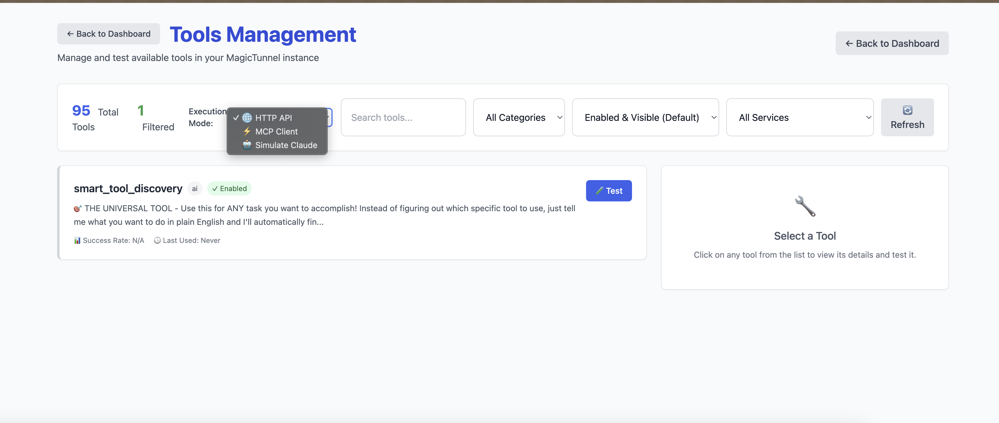
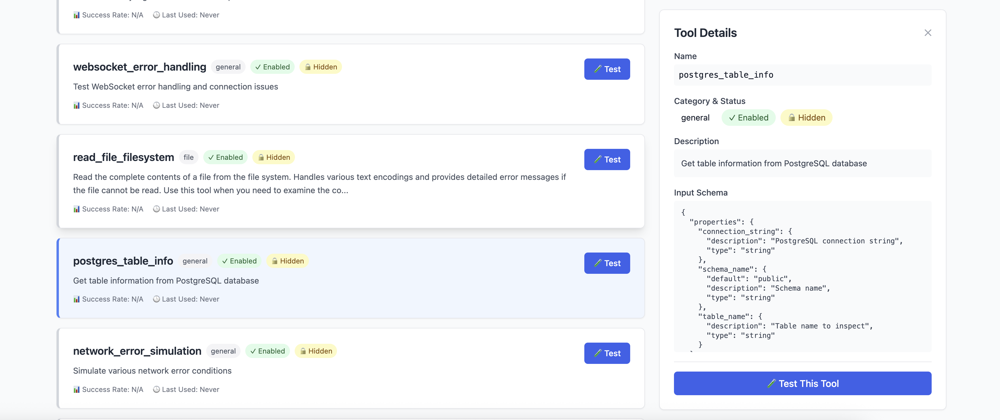
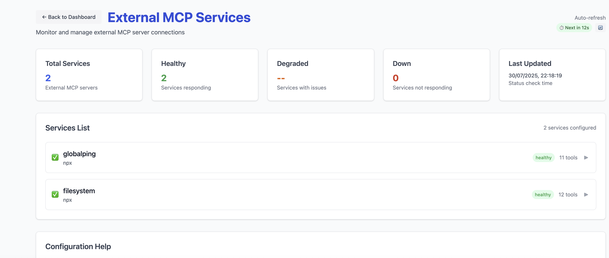
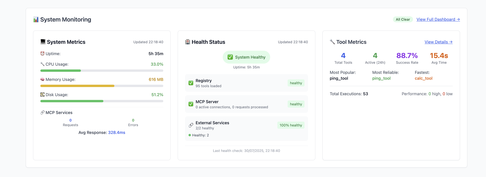
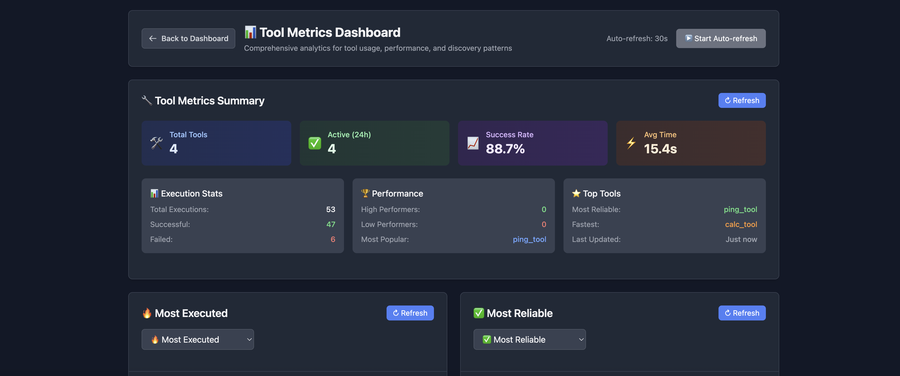
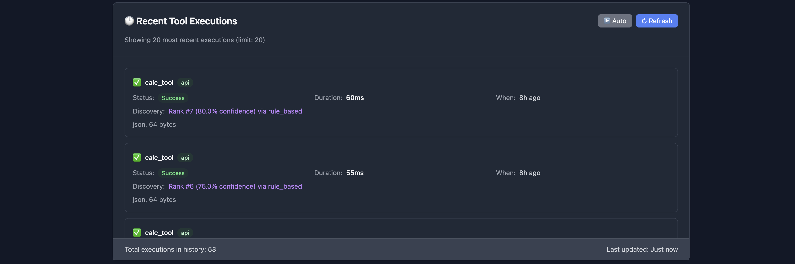
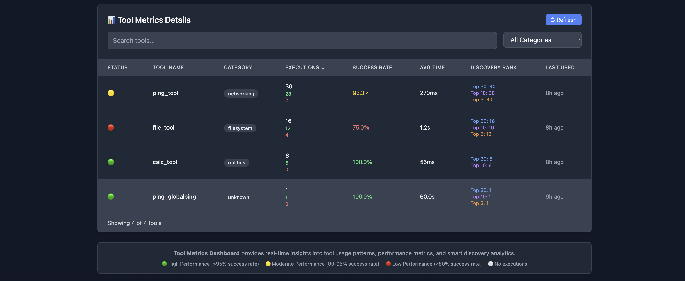
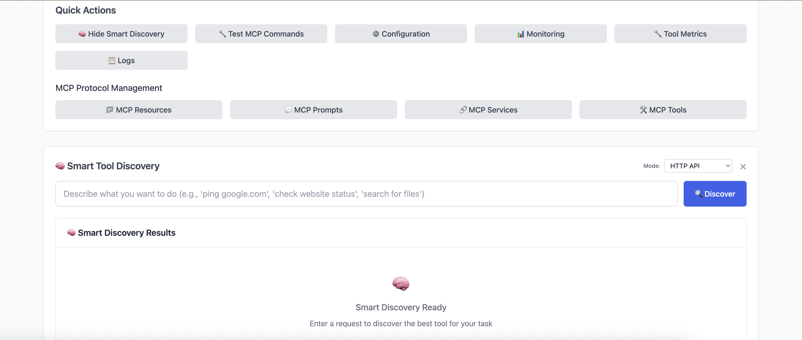
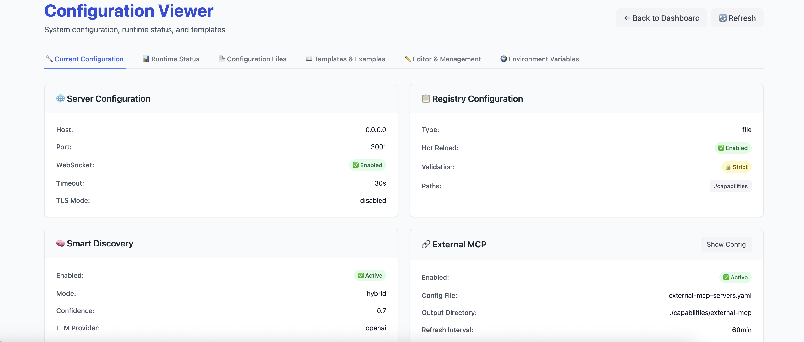
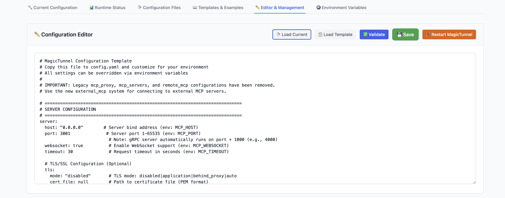

[More Images](docs/images/)