# MagicTunnel

**Smart MCP Proxy** - One intelligent tool that discovers the right tool for any request.

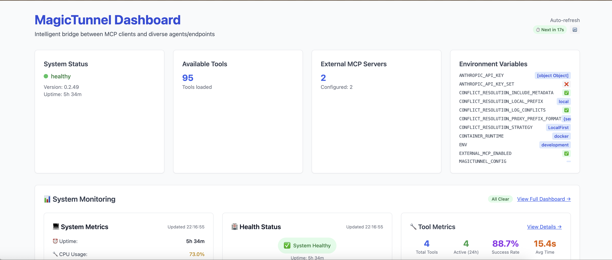

## The Problem
MCP clients get overwhelmed with 50+ tools. Users can't find the right tool for their task.

## The Solution  
MagicTunnel provides **one smart tool** that:
1. Analyzes your natural language request
2. Finds the best tool automatically  
3. Maps parameters and executes it
4. Returns the result

## Quick Start

> Semantic search is **optional**. The server runs in `rule_based` or `llm_based` discovery mode without any embeddings on disk. Ollama or an OpenAI key is required only for those richer discovery modes — not for the server to start.

### Prerequisites

- **Rust 1.70+** (`rustup` recommended)
- **`protoc`** (Protocol Buffers compiler) — required by `tonic-build` during `cargo build`
  - Windows: `scoop bucket add extras && scoop install protobuf` (or `choco install protoc`)
  - macOS: `brew install protobuf`
  - Linux: `apt install protobuf-compiler` (Debian/Ubuntu) / `dnf install protobuf-compiler` (Fedora)
- **OpenAI API key** *or* a running Ollama instance — only needed if you want LLM/semantic discovery modes; not required to start the server

### Windows (PowerShell)

```powershell
git clone https://github.com/your-org/magictunnel.git
cd magictunnel
# Prereqs (one-time): see Prerequisites above; protoc must be on PATH
cargo build --release
Copy-Item config.yaml.template magictunnel-config.yaml
# Edit magictunnel-config.yaml — at minimum, set the llm_provider section if you want LLM-based discovery
.\target\release\magictunnel.exe --config magictunnel-config.yaml

# In another shell, test smart discovery:
curl.exe -X POST http://localhost:3001/v1/mcp/call `
  -H "Content-Type: application/json" `
  -d '{\"name\":\"smart_tool_discovery\",\"arguments\":{\"request\":\"ping google.com\"}}'
```

Convenience helper: `.\dev.ps1` (debug build + run) or `.\dev.ps1 -Release`.

### macOS / Linux — Full Stack (with web dashboard)

```bash
# Clone and build
git clone https://github.com/your-org/magictunnel.git
cd magictunnel

# Quick setup with smart discovery (Ollama + development mode)
make build-release-semantic && make pregenerate-embeddings-ollama MAGICTUNNEL_ENV=development

# Run MagicTunnel with Web Dashboard & Supervisor
./magictunnel-supervisor

# Access Web Dashboard
open http://localhost:5173/dashboard

# Test smart discovery via API
curl -X POST http://localhost:3001/v1/mcp/call \
  -H "Content-Type: application/json" \
  -d '{
    "name": "smart_tool_discovery",
    "arguments": {"request": "ping google.com"}
  }'
```

### macOS / Linux — Lightweight (MCP server only)

```bash
# Run standalone MCP server (no web dashboard)
./magictunnel
```

### Setup with Semantic Search (Optional, macOS / Linux)

For the best experience with local semantic search (requires Ollama embedding model):

```bash
# Install Ollama (optional - for local semantic search)
curl -fsSL https://ollama.ai/install.sh | sh
ollama pull nomic-embed-text

# Build with semantic search support
make build-release-semantic

# Pre-generate embeddings for faster startup
make pregenerate-embeddings-ollama

# Run with smart discovery
make run-release-ollama
```

📚 **[Complete Setup Guide](docs/quickstart.md)** - Detailed 5-minute tutorial with web dashboard and all options

## Example Usage

Instead of knowing which specific tool to use:
```json
// ❌ Before: Need to know exact tool names
{"name": "network_ping", "arguments": {"host": "google.com"}}
{"name": "filesystem_read", "arguments": {"path": "/etc/hosts"}}
{"name": "database_query", "arguments": {"sql": "SELECT * FROM users"}}
```

Just describe what you want:
```json
// ✅ After: Natural language requests
{"name": "smart_tool_discovery", "arguments": {"request": "ping google.com"}}
{"name": "smart_tool_discovery", "arguments": {"request": "read the hosts file"}}  
{"name": "smart_tool_discovery", "arguments": {"request": "get all users from database"}}
```

## Configuration

Create `magictunnel-config.yaml`:
```yaml
server:
  host: "127.0.0.1"
  port: 8080

registry:
  paths: ["./capabilities"]

smart_discovery:
  enabled: true
  tool_selection_mode: "rule_based"  # or "llm_based"
```

## Web Dashboard

MagicTunnel includes a comprehensive web dashboard for management and monitoring:

### Access Dashboard
```bash
# Start with supervisor (includes web dashboard)
./target/release/magictunnel-supervisor

# Open in browser
open http://localhost:5173/dashboard
```

### Dashboard Features
- 📊 **Real-time Monitoring**: System status, performance metrics, and uptime tracking
- 🔧 **Tool Management**: Browse, test, and manage all available MCP tools
- 📈 **Tool Analytics**: Track tool usage patterns, execution metrics, and discovery rankings
- 📋 **Configuration Management**: Edit configuration files with validation and backup
- 📝 **Live Logs**: Real-time log viewer with filtering, search, and export
- 🔍 **MCP Testing**: Interactive JSON-RPC command testing interface
- ⚙️ **Service Control**: Start, stop, and restart services via web interface

## Add Your Tools

### Manual Tool Creation

Create `capabilities/my-tools.yaml`:
```yaml
tools:
  - name: "ping"
    description: "Test network connectivity to a host"
    input_schema:
      type: object
      properties:
        host:
          type: string
          description: "Hostname or IP address to ping"
    routing:
      type: "command"
      command: "ping"
      args: ["-c", "4", "{host}"]
```

### Generate Tools from APIs

Automatically generate tools from your existing APIs:

```bash
# Generate from OpenAPI/Swagger
./target/release/openapi-generator \
  --spec https://api.example.com/openapi.json \
  --output capabilities/api-tools.yaml \
  --base-url https://api.example.com \
  --auth-type bearer --auth-token $API_TOKEN

# Generate from gRPC services  
./target/release/grpc-generator \
  --proto service.proto \
  --output capabilities/grpc-tools.yaml \
  --endpoint localhost:50051

# Generate from GraphQL schemas
./target/release/graphql-generator \
  --schema schema.graphql \
  --endpoint https://api.example.com/graphql \
  --output capabilities/graphql-tools.yaml

# Unified CLI for all formats
./target/release/magictunnel-cli openapi --spec openapi.json --base-url https://api.example.com --output tools.yaml
```

📖 **[Complete API Generation Guide](docs/tools.md#generating-tools-from-apis)** - Detailed CLI documentation with all options and examples

## Features

- ✅ **Smart Discovery**: AI-powered tool selection with natural language interface
- 🖥️ **Web Dashboard**: Real-time monitoring, tool management, and configuration
- 🔧 **Supervisor Architecture**: Process management with automatic restart and health monitoring
- ✅ **MCP Compatible**: Works with Claude, GPT-4, any MCP client
- 🌐 **Protocol Gateway**: HTTP, SSE, WebSocket protocol translation for network MCP services
- ✅ **Easy Setup**: Single binary, YAML configuration  
- ✅ **Extensible**: Add tools without coding

## Documentation

### Core Documentation
- [🚀 Quick Start](docs/quickstart.md) - 5-minute setup guide with all options
- [🖥️ Web Dashboard](docs/web-dashboard.md) - Complete web interface guide
- [🔧 Supervisor System](docs/supervisor.md) - Process management and monitoring
- [🧠 Smart Discovery](docs/smart-discovery.md) - Intelligent tool discovery
- [🌐 Protocol Compatibility](docs/PROTOCOL_COMPATIBILITY.md) - Network MCP protocol translation

### Advanced Documentation
- [📖 Full Guide](docs/guide.md) - Complete documentation
- [🔧 Configuration](docs/config.md) - Configuration options
- [🛠️ Adding Tools](docs/tools.md) - How to add your own tools
- [🏗️ Architecture](docs/architecture.md) - Technical architecture
- [🔌 API Reference](docs/api.md) - Complete API documentation
- [🧪 Testing](docs/testing.md) - Testing and validation
- [🚀 Deployment](docs/deploy.md) - Production deployment
- [📊 Observability](docs/MCP_OBSERVABILITY_ARCHITECTURE.md) - Metrics and monitoring

### Development Documentation
- [📋 Frontend Development](docs/frontend_todo.md) - Frontend implementation roadmap
- [🔢 Version Management](docs/VERSION_MANAGEMENT.md) - Development workflow and versioning

[📚 View All Documentation](docs/)

## License

MIT License - see [LICENSE](LICENSE) for details.

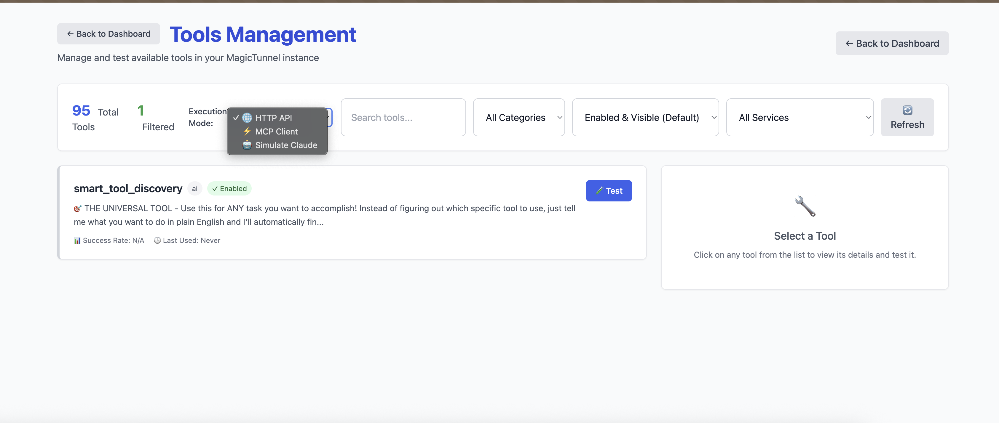
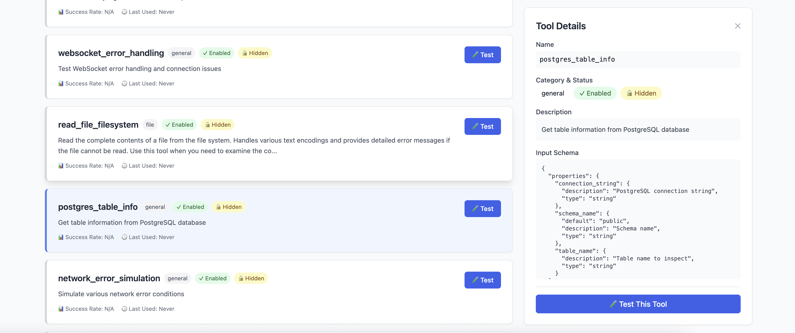
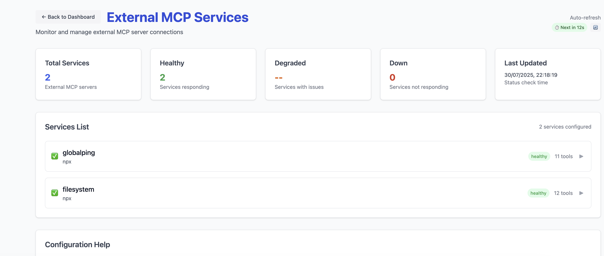
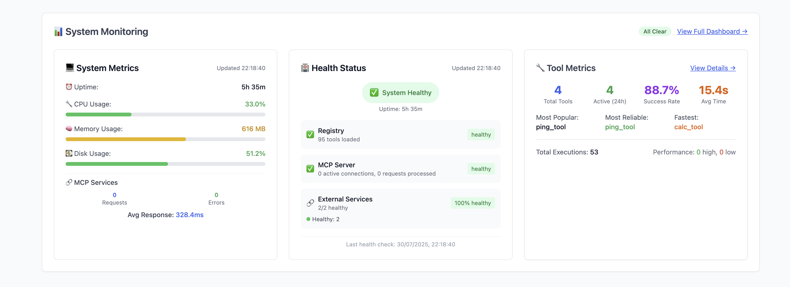
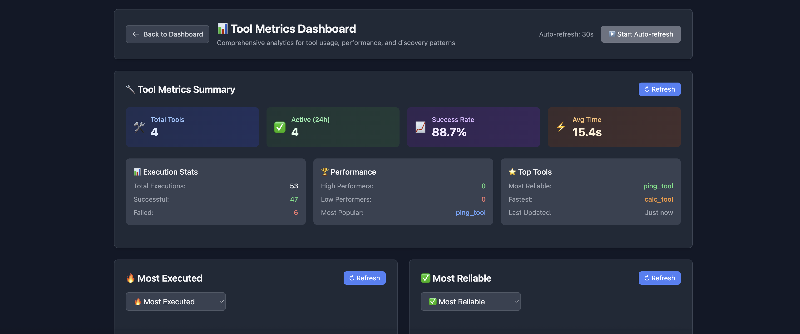
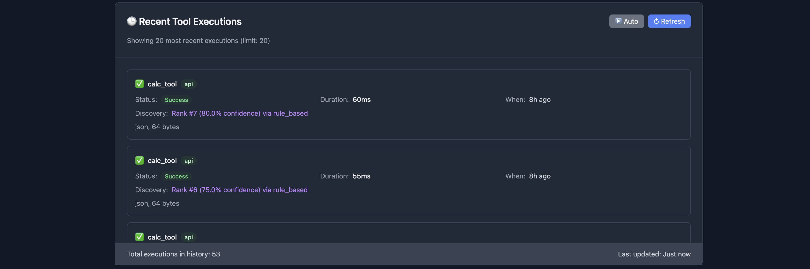
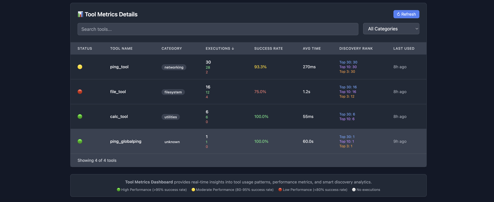
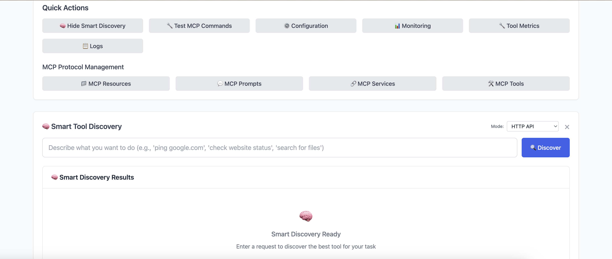
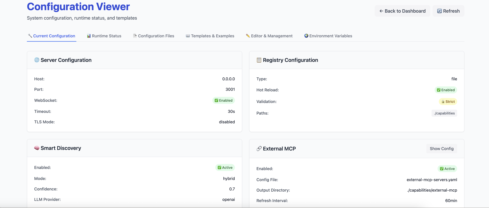
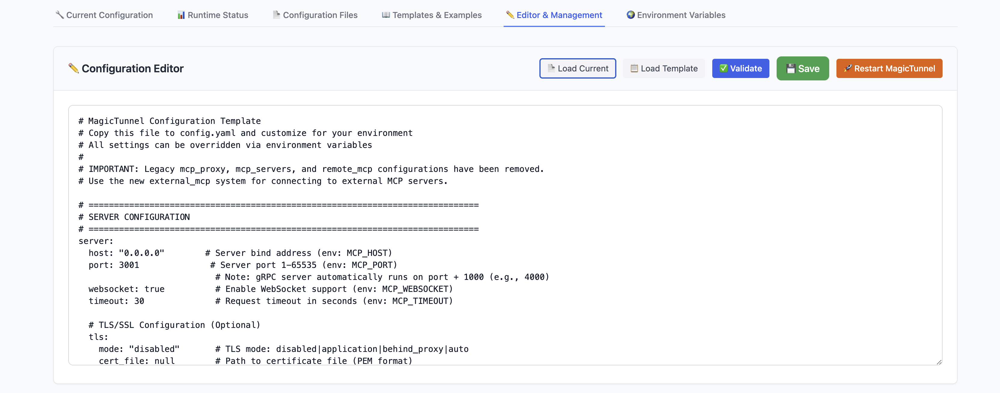

[More Images](docs/images/)