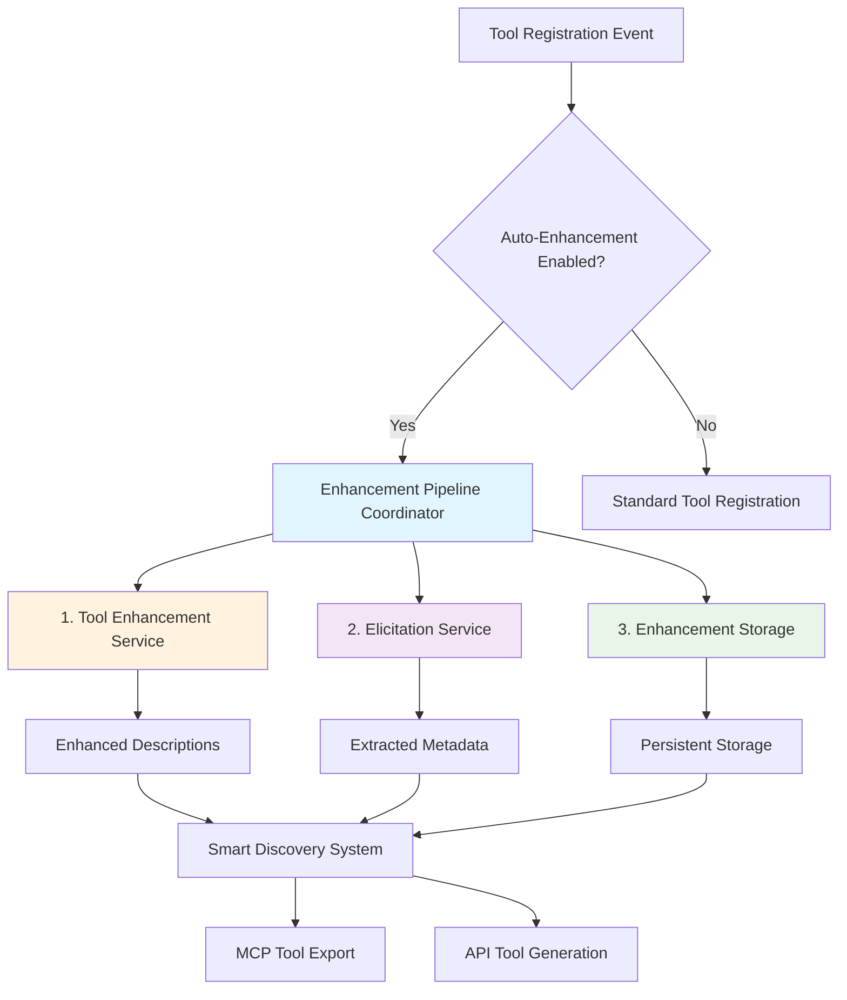
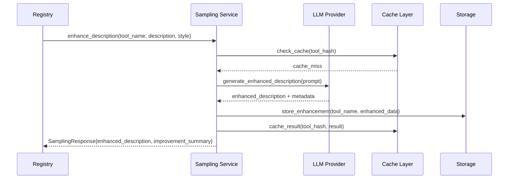
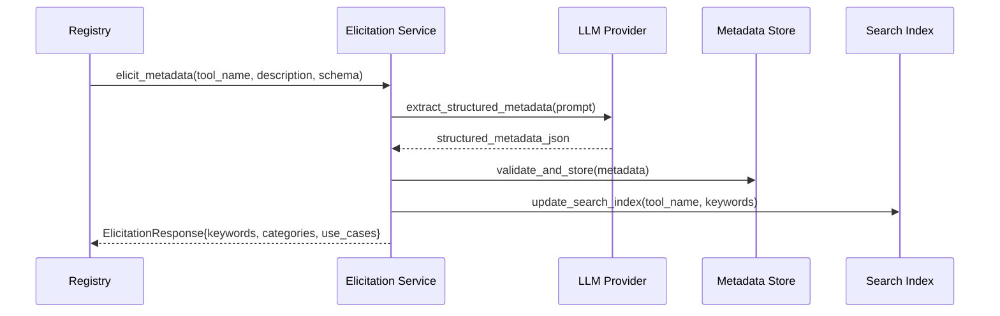

# MagicTunnel - Automatic LLM Generation Workflow Documentation

## Executive Summary

MagicTunnel features a comprehensive **Automatic LLM Generation Workflow** that intelligently enhances tools and capabilities using Large Language Models. This system implements the **MCP 2025-06-18 specification** for MCP sampling and elicitation, providing automated tool enhancement without manual intervention while maintaining full MCP compliance.

## Architecture Overview

### System Components



### Core Services Architecture

| Service | Location | Purpose | MCP 2025-06-18 Compliance |
|---------|----------|---------|---------------------------|
| **Sampling Service** | `src/mcp/sampling.rs` | Enhanced tool descriptions | ✅ Full MCP Sampling Support |
| **Elicitation Service** | `src/mcp/elicitation.rs` | Parameter validation & metadata | ✅ Full MCP Elicitation Support |
| **Enhancement Coordinator** | `src/discovery/enhancement.rs` | Pipeline orchestration | ✅ MCP-compliant coordination |
| **Enhancement Storage** | `src/discovery/enhancement_storage.rs` | Persistent enhancement data | ✅ UUID-based versioning |
| **LLM Management CLI** | `src/bin/magictunnel-llm.rs` | Administrative interface | ✅ External MCP protection |

## Workflow Process Detail

### Phase 1: Tool Registration Detection

**Trigger Events:**
- New capability file registration
- External MCP server tool discovery  
- Manual enhancement API calls
- Scheduled batch processing

**Implementation:**
```rust
// src/registry/service.rs - Registry Event Handler
pub async fn on_tool_registered(&self, tool: &ToolDefinition) -> Result<()> {
    if self.config.enhancement.auto_enhance_on_registration {
        let enhancement_task = self.enhancement_service.enhance_tool_async(
            &tool.name,
            EnhancementType::Full
        );
        
        // Non-blocking enhancement execution
        tokio::spawn(async move {
            if let Err(e) = enhancement_task.await {
                tracing::warn!("Auto-enhancement failed for tool {}: {}", tool.name, e);
                // Fallback to original tool definition
            }
        });
    }
    Ok(())
}
```

### Phase 2: Sampling Service - Description Enhancement

**Purpose:** Transform basic tool descriptions into comprehensive, user-friendly documentation using LLM-powered analysis.

**Process Flow:**


**Key Features:**
- **Style-based Enhancement**: `detailed`, `concise`, `technical` styles
- **Provider Flexibility**: OpenAI, Anthropic, Ollama support
- **Quality Validation**: Ensures enhanced descriptions maintain accuracy
- **Intelligent Caching**: SHA-256 based cache keys for consistency

**Example Transformation:**
```yaml
# Original Tool Description
name: "execute_command"
description: "Execute command on system"

# Enhanced Description (Detailed Style)
enhanced_description: |
  Execute shell commands on the local system with comprehensive error handling 
  and security validation. Supports both simple commands and complex scripts 
  with environment variable substitution. Returns structured output including 
  exit codes, stdout, stderr, and execution metadata. Ideal for automation 
  tasks, system administration, and development workflows.

improvement_summary: |
  Enhanced with security context, error handling details, use case examples, 
  and structured output description. Added clarity on environment support 
  and execution metadata return values.

confidence_score: 0.92
enhancement_timestamp: "2025-01-02T10:30:00Z"
```

### Phase 3: Elicitation Service - Metadata Extraction

**Purpose:** Extract comprehensive metadata and contextual information from tool definitions using structured LLM analysis.

**Process Flow:**


**Extracted Metadata Types:**
- **Keywords**: Relevant search terms and tags
- **Categories**: Functional classification (system, network, data, etc.)
- **Use Cases**: Practical application scenarios
- **Complexity Assessment**: Execution time estimates and difficulty
- **Security Considerations**: Potential security implications
- **Related Tools**: Tool relationship mapping

**Example Metadata Extraction:**
```yaml
metadata:
  keywords: ["command", "execution", "shell", "system", "automation", "cli"]
  categories: ["system", "administration", "development"]
  use_cases:
    - "Automated deployment scripts"
    - "System health monitoring" 
    - "Development build processes"
    - "File system operations"
  complexity_score: 7
  estimated_execution_time: "1-30 seconds"
  related_tools: ["read_file", "write_file", "http_request"]
  security_considerations: ["command_injection", "privilege_escalation"]
  confidence_score: 0.89
  extraction_timestamp: "2025-01-02T10:30:00Z"
```

### Phase 4: Enhancement Coordination

**Purpose:** Orchestrate the complete enhancement pipeline, coordinating tool enhancement and elicitation services for optimal results.

**Coordination Strategies:**

1. **Parallel Processing** (Default):
```rust
// Execute tool enhancement and elicitation concurrently
let (enhancement_result, elicitation_result) = tokio::try_join!(
    self.tool_enhancement_service.enhance_description(tool_name, description, style),
    self.elicitation_service.extract_metadata(tool_name, description, schema)
)?;
```

2. **Sequential Processing** (When dependencies exist):
```rust
// Use enhanced description for better elicitation
let enhancement_result = self.tool_enhancement_service.enhance_description(tool_name, description, style).await?;
let elicitation_result = self.elicitation_service.extract_metadata(
    tool_name, 
    &sampling_result.enhanced_description,  // Use enhanced description
    schema
).await?;
```

3. **Fallback Strategy**:
```rust
pub async fn enhance_with_fallback(&self, tool: &ToolDefinition) -> EnhancementResult {
    // Try full enhancement
    match self.full_enhancement(tool).await {
        Ok(result) => return result,
        Err(e) => tracing::warn!("Full enhancement failed: {}", e),
    }
    
    // Fallback to sampling only
    match self.sampling_only_enhancement(tool).await {
        Ok(result) => return result,
        Err(e) => tracing::warn!("Sampling enhancement failed: {}", e),
    }
    
    // Final fallback - return original tool
    EnhancementResult::original_with_errors(tool, vec![e])
}
```

## Configuration Management

### Service Configuration (`magictunnel-config.yaml`)

```yaml
# Sampling Service Configuration
sampling:
  enabled: true
  provider: "openai"  # openai, anthropic, ollama
  model: "gpt-4"
  default_style: "detailed"  # detailed, concise, technical
  cache_ttl_hours: 24
  max_retries: 3
  timeout_seconds: 30
  
# Elicitation Service Configuration  
elicitation:
  enabled: true
  provider: "anthropic"
  model: "claude-3-sonnet-20240229"
  extract_keywords: true
  extract_categories: true
  extract_use_cases: true
  cache_ttl_hours: 24
  max_retries: 3
  
# Enhancement Coordination
enhancement:
  enabled: true
  auto_enhance_on_registration: true
  default_enhancement_type: "full"  # full, sampling_only, elicitation_only
  parallel_processing: true
  batch_size: 10
  enable_caching: true
  fallback_on_failure: true
  
# Enhancement Storage
enhancement_storage:
  storage_path: "./data/enhancements"
  use_versioning: true
  cleanup_after_days: 90
  compression_enabled: true
```

### Provider Configuration

```yaml
# LLM Provider Settings
openai:
  api_key: "${OPENAI_API_KEY}"
  base_url: "https://api.openai.com/v1"
  timeout_seconds: 30
  rate_limit_per_minute: 60
  
anthropic:
  api_key: "${ANTHROPIC_API_KEY}"
  base_url: "https://api.anthropic.com"
  timeout_seconds: 30
  rate_limit_per_minute: 40
  
ollama:
  base_url: "${OLLAMA_BASE_URL:-http://localhost:11434}"
  model: "llama3.1:8b"
  timeout_seconds: 60
  rate_limit_per_minute: 20
```

## Management Interface

### CLI Management (`magictunnel-llm`)

The unified CLI provides comprehensive management for all LLM services:

**Service Status:**
```bash
# Complete health check
magictunnel-llm bulk health-check

# Service-specific status
magictunnel-llm sampling test --all-providers
magictunnel-llm elicitation test
```

**Enhancement Operations:**
```bash
# Generate enhancements for specific tool
magictunnel-llm enhancements regenerate --tool execute_command --type full

# Batch enhancement for all tools
magictunnel-llm enhancements regenerate --batch-size 5

# List enhanced tools with metadata
magictunnel-llm enhancements list --detailed --format json
```

**Content Management:**
```bash
# Generate prompts and resources
magictunnel-llm prompts generate --tool execute_command --types usage,validation
magictunnel-llm resources generate --tool execute_command --types documentation,examples

# Export all generated content
magictunnel-llm bulk export --output ./exports/$(date +%Y%m%d)/
```

### REST API Management

**Health Monitoring:**
```bash
# Service status endpoints
curl http://localhost:3001/dashboard/api/sampling/status
curl http://localhost:3001/dashboard/api/elicitation/status
curl http://localhost:3001/dashboard/api/enhancement/status
```

**Enhancement Operations:**
```bash
# Generate enhanced description
curl -X POST http://localhost:3001/dashboard/api/sampling/generate \
  -H "Content-Type: application/json" \
  -d '{
    "tool_name": "execute_command",
    "current_description": "Execute command on system",
    "style": "detailed",
    "context": "System administration tool"
  }'

# Extract metadata  
curl -X POST http://localhost:3001/dashboard/api/elicitation/generate \
  -H "Content-Type: application/json" \
  -d '{
    "tool_name": "execute_command", 
    "tool_description": "Execute shell commands...",
    "context": "Development automation"
  }'

# Full enhancement pipeline
curl -X POST http://localhost:3001/dashboard/api/enhancement/generate \
  -H "Content-Type: application/json" \
  -d '{
    "tool_name": "execute_command",
    "enhancement_type": "full",
    "force_regenerate": false
  }'
```

## Integration with Smart Discovery

### Enhanced Tool Discovery

The enhanced tools integrate seamlessly with MagicTunnel's Smart Discovery system:

```rust
// Enhanced discovery using sampling/elicitation results
pub async fn discover_tools(&self, request: &str) -> Result<DiscoveryResult> {
    let tools = self.registry.get_enhanced_tools();
    
    let discovery_candidates: Vec<_> = tools
        .iter()
        .map(|tool| {
            EnhancedToolCandidate {
                name: tool.name.clone(),
                description: tool.enhanced_description
                    .as_ref()
                    .unwrap_or(&tool.base_description),
                keywords: tool.metadata.keywords.clone(),
                categories: tool.metadata.categories.clone(),
                use_cases: tool.metadata.use_cases.clone(),
                confidence_multiplier: if tool.is_enhanced() { 1.2 } else { 1.0 },
            }
        })
        .collect();
    
    // Perform hybrid discovery with enhanced metadata
    self.hybrid_discovery_with_enhancements(request, discovery_candidates).await
}
```

### Confidence Scoring Enhancement

Enhanced tools receive improved confidence scores:

```rust
fn calculate_enhanced_confidence_score(
    &self,
    request: &str,
    tool: &EnhancedToolCandidate
) -> f64 {
    let mut score = 0.0;
    
    // Enhanced description matching (45% weight)
    score += 0.45 * self.semantic_similarity(request, &tool.description);
    
    // Keyword matching with elicitation data (30% weight)  
    score += 0.30 * self.enhanced_keyword_match(request, &tool.keywords);
    
    // Use case relevance (25% weight)
    score += 0.25 * self.use_case_relevance(request, &tool.use_cases);
    
    // Apply enhancement confidence multiplier
    score * tool.confidence_multiplier
}
```

## Performance Optimization

### Caching Strategy

**Multi-level Caching:**
```rust
pub struct EnhancementCache {
    // In-memory LRU cache for recent enhancements
    memory_cache: LruCache<String, EnhancementResult>,
    
    // Persistent disk cache for long-term storage
    disk_cache: DiskCache<EnhancementResult>,
    
    // Redis cache for distributed deployments
    redis_cache: Option<RedisCache>,
    
    ttl_duration: Duration,
}

impl EnhancementCache {
    pub async fn get_enhancement(&self, tool_hash: &str) -> Option<EnhancementResult> {
        // Check memory cache first (fastest)
        if let Some(result) = self.memory_cache.get(tool_hash) {
            if !self.is_expired(&result.timestamp) {
                return Some(result.clone());
            }
        }
        
        // Check Redis cache (distributed)
        if let Some(redis) = &self.redis_cache {
            if let Ok(Some(result)) = redis.get_enhancement(tool_hash).await {
                self.memory_cache.put(tool_hash.to_string(), result.clone());
                return Some(result);
            }
        }
        
        // Check disk cache (persistent)
        if let Ok(Some(result)) = self.disk_cache.get_enhancement(tool_hash).await {
            self.memory_cache.put(tool_hash.to_string(), result.clone());
            return Some(result);
        }
        
        None
    }
}
```

### Asynchronous Processing

**Background Enhancement Queue:**
```rust
pub async fn process_enhancement_queue(&self) {
    let mut interval = tokio::time::interval(Duration::from_secs(30));
    let semaphore = Arc::new(Semaphore::new(self.config.max_concurrent_enhancements));
    
    loop {
        interval.tick().await;
        
        if let Ok(pending_tools) = self.get_pending_enhancements().await {
            let batches = pending_tools.chunks(self.config.batch_size);
            
            for batch in batches {
                let enhancement_futures = batch
                    .iter()
                    .map(|tool| {
                        let semaphore = semaphore.clone();
                        let enhancement_service = self.clone();
                        let tool = tool.clone();
                        
                        async move {
                            let _permit = semaphore.acquire().await?;
                            enhancement_service.enhance_tool_with_retry(&tool).await
                        }
                    });
                
                // Process batch with concurrency control
                let results = futures::future::join_all(enhancement_futures).await;
                self.update_enhancement_results(results).await;
            }
        }
    }
}
```

### Rate Limiting and Resource Management

```rust
pub struct LLMResourceManager {
    provider_limiters: HashMap<String, RateLimiter>,
    circuit_breakers: HashMap<String, CircuitBreaker>,
    request_queue: Arc<Mutex<VecDeque<EnhancementRequest>>>,
}

impl LLMResourceManager {
    pub async fn execute_with_limits<F, R>(
        &self,
        provider: &str,
        operation: F
    ) -> Result<R, ResourceError>
    where
        F: Future<Output = Result<R, LLMError>>,
    {
        // Check circuit breaker
        if !self.circuit_breakers[provider].is_closed() {
            return Err(ResourceError::CircuitBreakerOpen);
        }
        
        // Apply rate limiting
        self.provider_limiters[provider].check_rate_limit().await?;
        
        // Execute with timeout and retry
        let result = timeout(
            Duration::from_secs(30),
            self.execute_with_retry(operation, 3)
        ).await??;
        
        // Update circuit breaker state
        self.circuit_breakers[provider].record_success();
        
        Ok(result)
    }
}
```

## External MCP Protection

### Automatic Detection and Warning System

The workflow includes comprehensive protection against overwriting external MCP server content:

```rust
// src/mcp/external_content_manager.rs
pub struct ExternalContentProtection {
    external_servers: HashMap<String, ExternalMCPServer>,
    protection_rules: Vec<ProtectionRule>,
}

impl ExternalContentProtection {
    pub fn check_tool_authority(&self, tool_name: &str) -> ToolAuthority {
        for (server_id, server) in &self.external_servers {
            if server.provides_tool(tool_name) {
                return ToolAuthority::External {
                    server_id: server_id.clone(),
                    warning: format!(
                        "Tool '{}' is provided by external MCP server '{}'. \
                        Generated content may conflict with server-provided content.",
                        tool_name, server_id
                    )
                };
            }
        }
        ToolAuthority::Internal
    }
    
    pub async fn safe_enhancement_check(
        &self, 
        tool_name: &str, 
        enhancement_type: &EnhancementType
    ) -> Result<(), ProtectionError> {
        match self.check_tool_authority(tool_name) {
            ToolAuthority::External { warning, .. } => {
                tracing::warn!("{}", warning);
                
                // Require explicit force flag for external tools
                if !enhancement_type.force_external() {
                    return Err(ProtectionError::ExternalToolProtection {
                        tool_name: tool_name.to_string(),
                        suggestion: "Use --force flag to override protection".to_string(),
                    });
                }
            }
            ToolAuthority::Internal => {
                // Safe to enhance internal tools
            }
        }
        Ok(())
    }
}
```

### CLI Protection Interface

```bash
# Check for external tool conflicts before enhancement
magictunnel-llm prompts check-external
⚠️  Found 3 tools from external MCP servers:
    - api_tool (from external-server-1)
    - database_query (from external-server-2)  
    - file_processor (from external-server-3)

# Force enhancement with explicit warning
magictunnel-llm enhancements regenerate --tool api_tool --force
⚠️  WARNING: Tool 'api_tool' is from external MCP server 'external-server-1'
⚠️  Generated content may conflict with server-provided content
✅ Enhancement completed with force override
```

## Monitoring and Observability

### Metrics Collection

```rust
#[derive(Debug, Clone)]
pub struct EnhancementMetrics {
    // Counters
    pub total_enhancements: Counter,
    pub successful_enhancements: Counter,
    pub failed_enhancements: Counter,
    pub cache_hits: Counter,
    pub cache_misses: Counter,
    
    // Histograms  
    pub enhancement_duration: Histogram,
    pub llm_request_duration: Histogram,
    pub cache_lookup_duration: Histogram,
    
    // Gauges
    pub pending_enhancements: Gauge,
    pub active_llm_connections: Gauge,
    pub cache_size: Gauge,
    
    // Provider-specific metrics
    pub provider_usage: HashMap<String, Counter>,
    pub provider_errors: HashMap<String, Counter>,
}

pub async fn record_enhancement_metrics(&self, result: &EnhancementResult) {
    // Update counters
    self.metrics.total_enhancements.inc();
    if result.is_success() {
        self.metrics.successful_enhancements.inc();
    } else {
        self.metrics.failed_enhancements.inc();
    }
    
    // Record duration
    self.metrics.enhancement_duration
        .observe(result.total_processing_time.as_secs_f64());
    
    // Provider usage tracking
    for provider in &result.providers_used {
        self.metrics.provider_usage
            .entry(provider.clone())
            .or_insert_with(Counter::new)
            .inc();
    }
    
    // OpenTelemetry tracing
    tracing::info!(
        tool_name = %result.tool_name,
        enhancement_type = ?result.enhancement_type,
        processing_time_ms = %result.total_processing_time.as_millis(),
        providers_used = ?result.providers_used,
        cache_hit = %result.cache_hit,
        success = %result.is_success(),
        "Enhancement completed"
    );
}
```

### Health Check System

```rust
pub async fn comprehensive_health_check(&self) -> HealthReport {
    let mut checks = Vec::new();
    
    // Service availability checks
    checks.push(self.check_tool_enhancement_service().await);
    checks.push(self.check_elicitation_service().await);
    checks.push(self.check_enhancement_storage().await);
    
    // Provider connectivity checks
    for provider in &["openai", "anthropic", "ollama"] {
        checks.push(self.check_provider_connectivity(provider).await);
    }
    
    // Performance checks
    checks.push(self.check_cache_performance().await);
    checks.push(self.check_queue_health().await);
    
    // External MCP checks
    checks.push(self.check_external_mcp_servers().await);
    
    HealthReport {
        overall_status: self.calculate_overall_status(&checks),
        individual_checks: checks,
        recommendations: self.generate_recommendations(&checks),
        timestamp: Utc::now(),
    }
}
```

## Error Handling and Recovery

### Comprehensive Error Types

```rust
#[derive(Debug, Clone, thiserror::Error)]
pub enum EnhancementError {
    // Provider errors
    #[error("LLM provider error: {0}")]
    LLMProviderError(String),
    
    #[error("Rate limit exceeded for provider {provider}: {details}")]
    RateLimitExceeded { provider: String, details: String },
    
    #[error("Authentication failed for provider {provider}")]
    AuthenticationFailed { provider: String },
    
    // Processing errors
    #[error("Invalid tool definition for {tool_name}: {reason}")]
    InvalidToolDefinition { tool_name: String, reason: String },
    
    #[error("Enhancement validation failed: {details}")]
    ValidationFailed { details: String },
    
    #[error("Request timeout after {duration:?}")]
    TimeoutError { duration: Duration },
    
    // System errors
    #[error("Cache error: {0}")]
    CacheError(String),
    
    #[error("Storage error: {0}")]  
    StorageError(String),
    
    #[error("Network error: {0}")]
    NetworkError(String),
    
    // External MCP errors
    #[error("External MCP protection: {tool_name} is from external server")]
    ExternalToolProtection { tool_name: String, suggestion: String },
}
```

### Recovery Strategies

```rust
pub async fn enhance_with_comprehensive_recovery(
    &self,
    tool: &ToolDefinition
) -> EnhancementResult {
    let mut attempt = 1;
    let max_attempts = 3;
    let mut last_error = None;
    
    while attempt <= max_attempts {
        match self.attempt_enhancement(tool, attempt).await {
            Ok(result) => return result,
            Err(e) => {
                last_error = Some(e.clone());
                
                match e {
                    EnhancementError::RateLimitExceeded { .. } => {
                        // Exponential backoff for rate limits
                        let delay = Duration::from_secs(2_u64.pow(attempt - 1));
                        tokio::time::sleep(delay).await;
                    }
                    EnhancementError::LLMProviderError(_) => {
                        // Try alternative provider
                        if let Some(fallback_provider) = self.get_fallback_provider().await {
                            tracing::info!("Switching to fallback provider: {}", fallback_provider);
                            self.switch_provider(fallback_provider).await;
                        }
                    }
                    EnhancementError::NetworkError(_) => {
                        // Network retry with backoff
                        tokio::time::sleep(Duration::from_secs(attempt * 2)).await;
                    }
                    _ => {
                        // For other errors, fail fast
                        break;
                    }
                }
            }
        }
        attempt += 1;
    }
    
    // All attempts failed - return graceful degradation
    EnhancementResult::failed_with_original(tool, last_error.unwrap())
}
```

## Enhancement Pipeline Management APIs

MagicTunnel provides comprehensive REST APIs for managing the enhancement pipeline programmatically. These APIs enable UI development, monitoring, and integration with external systems.

### Authentication

All Enhancement Pipeline APIs require authentication via API key or session token:

```bash
# Using API key
curl -H "Authorization: Bearer YOUR_API_KEY" \
     "http://localhost:3001/dashboard/api/enhancements/pipeline/status"

# Using session token
curl -H "X-Session-Token: YOUR_SESSION_TOKEN" \
     "http://localhost:3001/dashboard/api/enhancements/pipeline/status"
```

### Endpoints

#### 1. Pipeline Status

**GET** `/dashboard/api/enhancements/pipeline/status`

Get enhancement pipeline system health and configuration.

**Request:**
```bash
curl -X GET "http://localhost:3001/dashboard/api/enhancements/pipeline/status"
```

**Response:**
```json
{
  "enabled": true,
  "health_status": "healthy",
  "enhancement_pipeline_active": true,
  "total_tools": 83,
  "features": [
    "sampling_enhancement",
    "elicitation_enhancement",
    "enhancement_caching",
    "persistent_storage",
    "batch_processing"
  ],
  "providers": {
    "openai": "connected",
    "anthropic": "connected", 
    "ollama": "available"
  },
  "cache_statistics": {
    "cached_enhancements": 45,
    "cache_hit_rate": 0.78,
    "avg_generation_time_ms": 1200
  }
}
```

#### 2. Enhanced Tools Listing

**GET** `/dashboard/api/enhancements/pipeline/tools`

List all tools with their enhancement status and metadata.

**Query Parameters:**
- `filter` (optional): Filter by tool name or description
- `enhancement_status` (optional): Filter by status (enhanced/pending/failed)
- `limit` (optional): Maximum results per page (default: 50)
- `offset` (optional): Skip number of results

**Request:**
```bash
curl -X GET "http://localhost:3001/dashboard/api/enhancements/pipeline/tools?enhancement_status=enhanced&limit=10"
```

**Response:**
```json
{
  "tools": [
    {
      "name": "network_ping",
      "original_description": "Test network connectivity",
      "enhanced_description": "Test network connectivity to remote hosts with comprehensive diagnostics including latency, packet loss, and connection reliability metrics.",
      "enhancement_status": "enhanced",
      "enhancement_metadata": {
        "model_used": "gpt-4",
        "confidence_score": 0.92,
        "generated_at": "2025-08-03T10:30:00Z",
        "enhancement_time_ms": 1150
      },
      "keywords": ["network", "connectivity", "diagnostics", "latency"],
      "categories": ["networking", "monitoring"],
      "use_cases": ["troubleshooting", "monitoring", "performance_testing"]
    }
  ],
  "pagination": {
    "total": 83,
    "returned": 10,
    "has_more": true
  },
  "summary": {
    "enhanced_tools": 78,
    "pending_tools": 3,
    "failed_tools": 2
  }
}
```

#### 3. Individual Tool Enhancement

**POST** `/dashboard/api/enhancements/pipeline/tools/{tool_name}/enhance`

Trigger enhancement for a specific tool.

**Request Body:**
```json
{
  "force_regenerate": false,
  "enhancement_options": {
    "include_examples": true,
    "include_troubleshooting": true,
    "target_audience": "developers"
  }
}
```

**Request:**
```bash
curl -X POST "http://localhost:3001/dashboard/api/enhancements/pipeline/tools/network_ping/enhance" \
     -H "Content-Type: application/json" \
     -d '{"force_regenerate": true}'
```

**Response:**
```json
{
  "job_id": "enhance_network_ping_20250803_103045",
  "tool_name": "network_ping",
  "status": "started",
  "estimated_completion_time": "2025-08-03T10:32:00Z",
  "job_details": {
    "started_at": "2025-08-03T10:30:45Z",
    "model": "gpt-4",
    "provider": "openai",
    "force_regenerate": true
  }
}
```

#### 4. Enhancement Jobs Tracking

**GET** `/dashboard/api/enhancements/pipeline/jobs`

Track enhancement job status and history.

**Query Parameters:**
- `status` (optional): Filter by job status (running/completed/failed)
- `tool_name` (optional): Filter by specific tool
- `limit` (optional): Maximum results per page (default: 20)

**Request:**
```bash
curl -X GET "http://localhost:3001/dashboard/api/enhancements/pipeline/jobs?status=running"
```

**Response:**
```json
{
  "jobs": [
    {
      "job_id": "enhance_network_ping_20250803_103045",
      "tool_name": "network_ping",
      "status": "running",
      "progress": 0.75,
      "started_at": "2025-08-03T10:30:45Z",
      "estimated_completion": "2025-08-03T10:32:00Z",
      "provider": "openai",
      "model": "gpt-4"
    },
    {
      "job_id": "enhance_file_read_20250803_102830",
      "tool_name": "file_read",
      "status": "completed",
      "started_at": "2025-08-03T10:28:30Z",
      "completed_at": "2025-08-03T10:29:45Z",
      "duration_ms": 75000,
      "provider": "anthropic",
      "model": "claude-3-sonnet",
      "result": {
        "success": true,
        "confidence_score": 0.89,
        "improvement_summary": "Enhanced with comprehensive examples and error handling guidance"
      }
    }
  ],
  "summary": {
    "total_jobs": 127,
    "running_jobs": 1,
    "completed_jobs": 124,
    "failed_jobs": 2
  }
}
```

#### 5. Batch Enhancement

**POST** `/dashboard/api/enhancements/pipeline/batch`

Process multiple tools for enhancement in batch.

**Request Body:**
```json
{
  "tool_names": ["network_ping", "file_read", "database_query"],
  "batch_options": {
    "concurrency": 3,
    "force_regenerate": false,
    "target_audience": "developers",
    "stop_on_first_error": false
  }
}
```

**Request:**
```bash
curl -X POST "http://localhost:3001/dashboard/api/enhancements/pipeline/batch" \
     -H "Content-Type: application/json" \
     -d '{"tool_names": ["network_ping", "file_read"], "batch_options": {"concurrency": 2}}'
```

**Response:**
```json
{
  "batch_id": "batch_20250803_103200",
  "total_tools": 2,
  "jobs_created": [
    {
      "job_id": "enhance_network_ping_20250803_103201",
      "tool_name": "network_ping",
      "status": "queued"
    },
    {
      "job_id": "enhance_file_read_20250803_103202", 
      "tool_name": "file_read",
      "status": "queued"
    }
  ],
  "batch_settings": {
    "concurrency": 2,
    "estimated_total_time": "2025-08-03T10:35:00Z"
  }
}
```

#### 6. Cache Management

**DELETE** `/dashboard/api/enhancements/pipeline/cache`

Clear enhancement cache with optional filtering.

**Query Parameters:**
- `tool_name` (optional): Clear cache for specific tool
- `older_than` (optional): Clear cache older than timestamp
- `confirm` (required): Must be "true" to confirm deletion

**Request:**
```bash
curl -X DELETE "http://localhost:3001/dashboard/api/enhancements/pipeline/cache?confirm=true"
```

**Response:**
```json
{
  "cache_cleared": true,
  "items_removed": 45,
  "cache_size_before_mb": 12.5,
  "cache_size_after_mb": 0.0,
  "operation_time_ms": 150
}
```

#### 7. Pipeline Statistics

**GET** `/dashboard/api/enhancements/pipeline/statistics`

Get comprehensive analytics and performance metrics.

**Request:**
```bash
curl -X GET "http://localhost:3001/dashboard/api/enhancements/pipeline/statistics"
```

**Response:**
```json
{
  "overview": {
    "total_tools": 83,
    "enhanced_tools": 78,
    "enhancement_rate": 0.94,
    "avg_enhancement_time_ms": 1150,
    "total_enhancements_generated": 156
  },
  "by_provider": {
    "openai": {
      "enhancements": 89,
      "avg_time_ms": 1200,
      "success_rate": 0.96,
      "cost_estimate_usd": 12.34
    },
    "anthropic": {
      "enhancements": 45,
      "avg_time_ms": 1050,
      "success_rate": 0.91,
      "cost_estimate_usd": 8.76
    },
    "ollama": {
      "enhancements": 22,
      "avg_time_ms": 2100,
      "success_rate": 0.88,
      "cost_estimate_usd": 0.0
    }
  },
  "performance_trends": {
    "enhancements_last_24h": 12,
    "avg_confidence_score": 0.89,
    "cache_hit_rate": 0.78,
    "error_rate": 0.04
  },
  "quality_metrics": {
    "avg_description_improvement": 2.8,
    "avg_keywords_extracted": 6.2,
    "avg_use_cases_identified": 3.4
  }
}
```

#### 8. Provider Health

**GET** `/dashboard/api/enhancements/pipeline/providers`

Check health and configuration of all LLM providers.

**Request:**
```bash
curl -X GET "http://localhost:3001/dashboard/api/enhancements/pipeline/providers"
```

**Response:**
```json
{
  "providers": [
    {
      "name": "openai",
      "type": "OpenAI",
      "status": "healthy",
      "endpoint": "https://api.openai.com/v1/chat/completions",
      "models": ["gpt-4", "gpt-3.5-turbo"],
      "default_model": "gpt-4",
      "rate_limits": {
        "requests_per_minute": 50,
        "tokens_per_minute": 100000
      },
      "last_check": "2025-08-03T10:30:00Z",
      "response_time_ms": 450
    },
    {
      "name": "anthropic",
      "type": "Anthropic", 
      "status": "healthy",
      "endpoint": "https://api.anthropic.com/v1/messages",
      "models": ["claude-3-sonnet", "claude-3-haiku"],
      "default_model": "claude-3-sonnet",
      "rate_limits": {
        "requests_per_minute": 30,
        "tokens_per_minute": 80000
      },
      "last_check": "2025-08-03T10:29:45Z",
      "response_time_ms": 380
    }
  ],
  "health_summary": {
    "total_providers": 2,
    "healthy_providers": 2,
    "degraded_providers": 0,
    "offline_providers": 0
  }
}
```

#### 9. Enhancement Validation

**POST** `/dashboard/api/enhancements/pipeline/validate`

Validate enhancement configuration and test provider connectivity.

**Request Body:**
```json
{
  "test_tool": "network_ping",
  "providers_to_test": ["openai", "anthropic"],
  "validate_config": true
}
```

**Request:**
```bash
curl -X POST "http://localhost:3001/dashboard/api/enhancements/pipeline/validate" \
     -H "Content-Type: application/json" \
     -d '{"test_tool": "network_ping", "validate_config": true}'
```

**Response:**
```json
{
  "validation_results": {
    "config_valid": true,
    "providers_tested": 2,
    "providers_healthy": 2,
    "test_enhancement": {
      "success": true,
      "tool_name": "network_ping",
      "provider_used": "openai",
      "generation_time_ms": 1050,
      "confidence_score": 0.91
    }
  },
  "provider_results": [
    {
      "provider": "openai",
      "status": "healthy",
      "response_time_ms": 450,
      "test_successful": true
    },
    {
      "provider": "anthropic", 
      "status": "healthy",
      "response_time_ms": 380,
      "test_successful": true
    }
  ],
  "overall_health": "excellent"
}
```

### Error Handling

All Enhancement Pipeline APIs return consistent error responses:

**Error Response Format:**
```json
{
  "error": {
    "code": "ENHANCEMENT_FAILED",
    "message": "Tool enhancement failed",
    "details": "Provider rate limit exceeded, retry in 60 seconds",
    "timestamp": "2025-08-03T10:30:00Z",
    "request_id": "req_123456789",
    "retry_after_seconds": 60
  }
}
```

**Common Error Codes:**
- `TOOL_NOT_FOUND` (404): Specified tool does not exist
- `ENHANCEMENT_FAILED` (500): Enhancement generation failed
- `PROVIDER_UNAVAILABLE` (503): LLM provider is offline or rate-limited
- `INVALID_CONFIGURATION` (400): Enhancement configuration is invalid
- `JOB_NOT_FOUND` (404): Enhancement job not found
- `CACHE_ERROR` (500): Cache operation failed
- `BATCH_SIZE_EXCEEDED` (413): Too many tools in batch request

### Usage Examples

#### Complete Enhancement Workflow

```bash
# 1. Check pipeline status
curl -X GET "http://localhost:3001/dashboard/api/enhancements/pipeline/status"

# 2. List current enhanced tools
curl -X GET "http://localhost:3001/dashboard/api/enhancements/pipeline/tools?limit=5"

# 3. Enhance a specific tool
curl -X POST "http://localhost:3001/dashboard/api/enhancements/pipeline/tools/network_ping/enhance" \
     -H "Content-Type: application/json" \
     -d '{"force_regenerate": false}'

# 4. Track the enhancement job
curl -X GET "http://localhost:3001/dashboard/api/enhancements/pipeline/jobs?tool_name=network_ping"

# 5. Check provider health
curl -X GET "http://localhost:3001/dashboard/api/enhancements/pipeline/providers"

# 6. Get performance statistics
curl -X GET "http://localhost:3001/dashboard/api/enhancements/pipeline/statistics"
```

#### Batch Enhancement with Monitoring

```bash
# 1. Start batch enhancement
BATCH_RESPONSE=$(curl -X POST "http://localhost:3001/dashboard/api/enhancements/pipeline/batch" \
     -H "Content-Type: application/json" \
     -d '{"tool_names": ["tool1", "tool2", "tool3"], "batch_options": {"concurrency": 2}}')

# 2. Extract batch ID
BATCH_ID=$(echo $BATCH_RESPONSE | jq -r '.batch_id')

# 3. Monitor batch progress
while true; do
    curl -X GET "http://localhost:3001/dashboard/api/enhancements/pipeline/jobs?batch_id=$BATCH_ID"
    sleep 5
done

# 4. Get final statistics
curl -X GET "http://localhost:3001/dashboard/api/enhancements/pipeline/statistics"
```

#### Cache Management and Optimization

```bash
# 1. Check cache statistics
curl -X GET "http://localhost:3001/dashboard/api/enhancements/pipeline/statistics" | jq '.performance_trends.cache_hit_rate'

# 2. Clear old cache entries
curl -X DELETE "http://localhost:3001/dashboard/api/enhancements/pipeline/cache?older_than=2025-08-01T00:00:00Z&confirm=true"

# 3. Validate configuration
curl -X POST "http://localhost:3001/dashboard/api/enhancements/pipeline/validate" \
     -H "Content-Type: application/json" \
     -d '{"validate_config": true}'
```

## Future Enhancements and Roadmap

### Planned Features (Q1-Q2 2025)

1. **Multi-modal Enhancement Support**
   - Image-based tool documentation generation
   - Video tutorial creation for complex tools
   - Interactive example generation

2. **Advanced AI Capabilities**
   - Custom fine-tuned models for domain-specific enhancements
   - Reinforcement learning from user feedback
   - Multi-language tool description generation

3. **Enterprise Features**
   - Role-based enhancement approvals
   - Custom enhancement templates
   - Integration with enterprise LLM providers

4. **Community and Collaboration**
   - Enhancement template marketplace
   - Community-driven enhancement sharing
   - Collaborative enhancement editing

### Integration Opportunities

1. **Development Workflow Integration**
   - IDE plugins for real-time enhancement
   - Git hooks for automatic enhancement on commits
   - CI/CD pipeline integration for enhancement validation

2. **MCP Ecosystem Integration**
   - Standard enhancement formats for MCP registry
   - Cross-server enhancement synchronization
   - Enhancement metadata in MCP protocol extensions

## Conclusion

The Automatic LLM Generation Workflow represents a significant advancement in tool usability and discovery within the MCP ecosystem. By automatically enhancing tool descriptions and extracting rich metadata, MagicTunnel provides:

- **Improved Tool Discovery**: Enhanced descriptions and metadata improve Smart Discovery accuracy
- **Better User Experience**: Clear, comprehensive tool documentation reduces learning curve
- **Scalable Enhancement**: Automatic processing handles large tool catalogs efficiently
- **MCP 2025-06-18 Compliance**: Full implementation of modern MCP sampling and elicitation features
- **Enterprise Safety**: Comprehensive protection against external MCP content conflicts

This system transforms MagicTunnel from a simple MCP proxy into an intelligent tool enhancement platform that continuously improves the user experience while maintaining compatibility and safety standards.