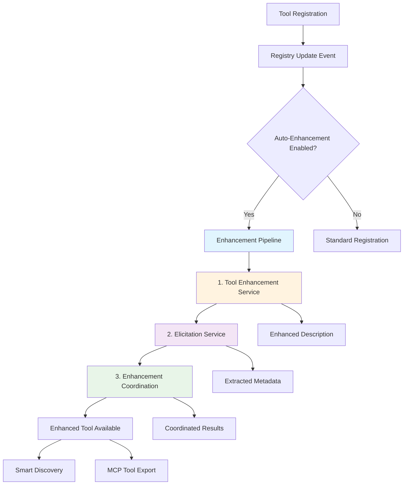
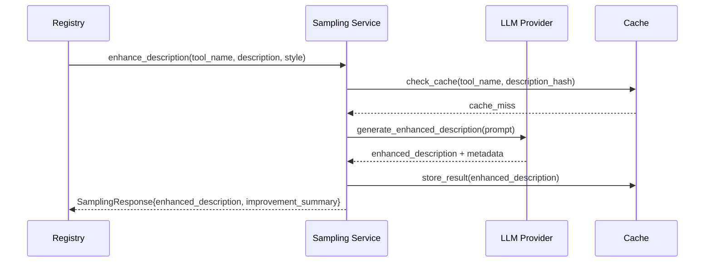
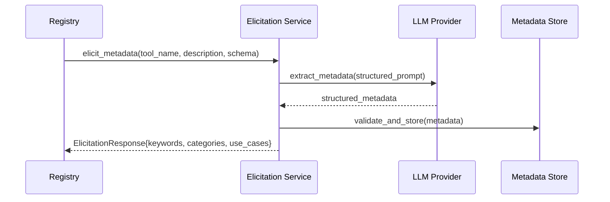
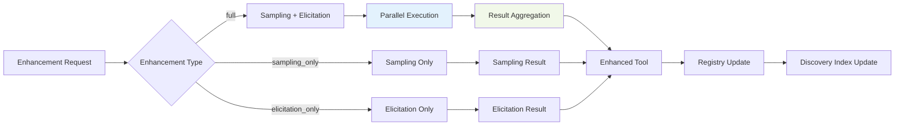

# MagicTunnel LLM Enhancement Workflow

## Overview

MagicTunnel implements a sophisticated **automatic LLM generation workflow** that enhances tool descriptions and metadata using Large Language Models. This system follows the **MCP 2025-06-18 specification** for sampling and elicitation capabilities, providing intelligent tool enhancement without manual intervention.

## Architecture Overview



## Core Components

### 1. Tool Enhancement Service (`src/mcp/tool_enhancement.rs`)

**Purpose**: Enhances tool descriptions using LLM-powered analysis to improve clarity, detail, and usability. This service was previously called "sampling" but has been renamed to avoid confusion with MCP sampling (server→client LLM requests).

**Key Features**:
- **Style-based Enhancement**: Supports `detailed`, `concise`, and `technical` styles
- **Context-aware Generation**: Uses tool schemas and usage patterns for informed enhancement
- **Provider Flexibility**: Supports OpenAI, Anthropic, and Ollama LLM providers
- **Quality Validation**: Ensures enhanced descriptions maintain accuracy and relevance

**Implementation**:
```rust
pub async fn generate_enhanced_description_request(
    &self,
    tool_name: &str,
    original_description: &str,
    style: DescriptionStyle,
    context: Option<&str>
) -> Result<SamplingResponse, SamplingError>
```

### 2. Elicitation Service (`src/mcp/elicitation.rs`)

**Purpose**: Extracts comprehensive metadata and contextual information from tool definitions using structured LLM analysis.

**Key Features**:
- **Keyword Extraction**: Identifies relevant keywords and tags for tool discovery
- **Category Classification**: Automatically categorizes tools by function and domain
- **Use Case Generation**: Creates practical usage scenarios and examples
- **Complexity Assessment**: Evaluates tool complexity and execution time estimates
- **Relationship Mapping**: Identifies related tools and dependency patterns

**Implementation**:
```rust
pub async fn generate_elicitation_request(
    &self,
    tool_name: &str,
    tool_description: &str,
    input_schema: Option<&Value>
) -> Result<ElicitationResponse, ElicitationError>
```

### 3. Enhancement Coordination (`src/discovery/enhancement.rs`)

**Purpose**: Orchestrates the complete enhancement pipeline, coordinating sampling and elicitation services for optimal tool improvement.

**Key Features**:
- **Pipeline Coordination**: Manages sequential execution of sampling → elicitation
- **Parallel Processing**: Executes independent enhancements concurrently
- **Error Handling**: Graceful degradation when individual services fail
- **Result Aggregation**: Combines sampling and elicitation results into unified enhancement
- **Caching Strategy**: Avoids redundant processing through intelligent caching

## Workflow Process

### Phase 1: Tool Registration Detection

```rust
// Registry event triggers enhancement pipeline
pub fn on_tool_registered(&self, tool: &ToolDefinition) {
    if self.config.auto_enhancement_enabled {
        tokio::spawn(async move {
            self.enhancement_service.enhance_tool(tool).await
        });
    }
}
```

**Triggers**:
- New tool registration in capability files
- External MCP server tool discovery
- Manual enhancement requests via API/CLI
- Scheduled enhancement batch processing

### Phase 2: Sampling (Description Enhancement)



**Process**:
1. **Input Analysis**: Analyzes original tool description and input schema
2. **Prompt Construction**: Creates context-aware prompts for LLM enhancement
3. **LLM Generation**: Calls configured LLM provider (OpenAI/Anthropic/Ollama)
4. **Quality Validation**: Validates enhanced description against quality criteria
5. **Result Packaging**: Returns structured response with enhancement metadata

**Example Enhancement**:
```yaml
# Original Description
description: "Execute command on system"

# Enhanced Description (Detailed Style)
enhanced_description: |
  Execute shell commands on the local system with comprehensive error handling 
  and security validation. Supports both simple commands and complex scripts 
  with environment variable substitution. Returns structured output including 
  exit codes, stdout, stderr, and execution metadata. Ideal for automation 
  tasks, system administration, and development workflows.

improvement_summary: |
  Enhanced with security context, error handling details, use case examples, 
  and structured output description. Added clarity on environment support 
  and execution metadata.
```

### Phase 3: Elicitation (Metadata Extraction)



**Process**:
1. **Schema Analysis**: Examines tool input schema and parameter patterns
2. **Contextual Extraction**: Uses enhanced description for informed metadata generation
3. **Structured Prompting**: Employs structured prompts for consistent metadata format
4. **Validation & Filtering**: Validates extracted metadata against quality standards
5. **Storage & Indexing**: Stores metadata for enhanced discovery and search

**Example Extraction**:
```yaml
metadata:
  keywords: ["command", "execution", "shell", "system", "automation", "cli"]
  categories: ["system", "administration", "development"]
  use_cases:
    - "Automated deployment scripts"
    - "System health monitoring"
    - "Development build processes"
    - "File system operations"
  complexity_score: 7
  estimated_execution_time: "1-30 seconds"
  related_tools: ["read_file", "write_file", "http_request"]
  security_considerations: ["command_injection", "privilege_escalation"]
```

### Phase 4: Enhancement Coordination



**Coordination Logic**:
```rust
pub async fn enhance_tool(
    &self,
    tool_name: &str,
    enhancement_type: EnhancementType
) -> Result<EnhancementResult, EnhancementError> {
    let start_time = Instant::now();
    let mut pipeline_results = Vec::new();
    
    match enhancement_type {
        EnhancementType::Full => {
            // Execute sampling and elicitation in parallel
            let (sampling_result, elicitation_result) = tokio::try_join!(
                self.execute_sampling(tool_name),
                self.execute_elicitation(tool_name)
            )?;
            
            pipeline_results.push(("sampling", sampling_result));
            pipeline_results.push(("elicitation", elicitation_result));
        },
        EnhancementType::SamplingOnly => {
            let result = self.execute_sampling(tool_name).await?;
            pipeline_results.push(("sampling", result));
        },
        EnhancementType::ElicitationOnly => {
            let result = self.execute_elicitation(tool_name).await?;
            pipeline_results.push(("elicitation", result));
        }
    }
    
    Ok(EnhancementResult {
        tool_name: tool_name.to_string(),
        enhancement_type,
        results: self.aggregate_results(pipeline_results),
        total_processing_time: start_time.elapsed(),
        timestamp: Utc::now(),
    })
}
```

## Configuration

### Service Configuration (`magictunnel-config.yaml`)

```yaml
# LLM Service Configuration
sampling:
  enabled: true
  provider: "openai"  # openai, anthropic, ollama
  model: "gpt-4"
  default_style: "detailed"
  cache_ttl_hours: 24
  max_retries: 3
  
elicitation:
  enabled: true
  provider: "anthropic"
  model: "claude-3-sonnet-20240229"
  extract_keywords: true
  extract_categories: true
  extract_use_cases: true
  cache_ttl_hours: 24
  
enhancement:
  enabled: true
  auto_enhance_on_registration: true
  default_enhancement_type: "full"
  parallel_processing: true
  batch_size: 10
  enable_caching: true
```

### Provider Configuration

```yaml
# OpenAI Configuration
openai:
  api_key: "${OPENAI_API_KEY}"
  base_url: "https://api.openai.com/v1"
  timeout_seconds: 30
  
# Anthropic Configuration  
anthropic:
  api_key: "${ANTHROPIC_API_KEY}"
  base_url: "https://api.anthropic.com"
  timeout_seconds: 30
  
# Ollama Configuration
ollama:
  base_url: "${OLLAMA_BASE_URL:-http://localhost:11434}"
  model: "llama3.1:8b"
  timeout_seconds: 60
```

## API Usage

### CLI Commands

```bash
# Manual tool enhancement
magictunnel enhance tool my_tool --type full --style detailed

# Batch enhancement
magictunnel enhance batch --capability-file capabilities/tools.yaml

# Enhancement status
magictunnel enhance status my_tool

# Force re-enhancement
magictunnel enhance tool my_tool --force --type sampling_only
```

### REST API Endpoints

```bash
# Get service status (UPDATED: v0.3.8 - Use proper endpoints)
# curl -X GET http://localhost:3001/dashboard/api/sampling/status    # REMOVED: Use /llm/providers/* instead
curl -X GET http://localhost:3001/dashboard/api/enhancement/status

# Generate enhanced description (UPDATED: v0.3.8 - Use proper tool enhancement)
curl -X POST http://localhost:3001/dashboard/api/enhancement/generate \
  -H "Content-Type: application/json" \
  -d '{
    "tool_name": "execute_command",
    "enable_sampling": true,
    "enable_elicitation": true
  }'

# Get elicitation metadata (REMOVED in v0.3.7 - use enhancement pipeline instead)  
# curl -X POST http://localhost:3001/dashboard/api/elicitation/generate \
#   -H "Content-Type: application/json" \
#   -d '{
#     "tool_name": "execute_command",
#     "tool_description": "Execute shell commands...",
#     "context": "Development automation"
#   }'

# Full enhancement pipeline
curl -X POST http://localhost:3001/dashboard/api/enhancement/generate \
  -H "Content-Type: application/json" \
  -d '{
    "tool_name": "execute_command",
    "enhancement_type": "full",
    "force_regenerate": false
  }'
```

## Integration with Smart Discovery

### Enhanced Tool Discovery

The LLM-enhanced tools integrate seamlessly with MagicTunnel's Smart Discovery system:

```rust
// Enhanced discovery using sampling results
pub async fn discover_tools(&self, request: &str) -> Result<DiscoveryResult> {
    let tools = self.registry.get_all_tools();
    
    // Use enhanced descriptions for better matching
    let enhanced_tools: Vec<_> = tools
        .iter()
        .map(|tool| {
            let description = tool.enhanced_description
                .as_ref()
                .unwrap_or(&tool.description);
            
            EnhancedToolInfo {
                name: tool.name.clone(),
                description: description.clone(),
                keywords: tool.metadata.keywords.clone(),
                categories: tool.metadata.categories.clone(),
                use_cases: tool.metadata.use_cases.clone(),
            }
        })
        .collect();
    
    // Perform hybrid discovery with enhanced metadata
    self.hybrid_discovery(request, enhanced_tools).await
}
```

### Discovery Confidence Scoring

Enhanced tools receive higher confidence scores in discovery:

```rust
fn calculate_confidence_score(
    &self,
    request: &str,
    tool: &EnhancedToolInfo
) -> f64 {
    let mut score = 0.0;
    
    // Base description matching (40% weight)
    score += 0.4 * self.semantic_similarity(request, &tool.description);
    
    // Enhanced metadata matching (35% weight)
    score += 0.35 * self.keyword_match_score(request, &tool.keywords);
    
    // Use case relevance (25% weight)
    score += 0.25 * self.use_case_relevance(request, &tool.use_cases);
    
    score
}
```

## Performance Considerations

### Caching Strategy

```rust
pub struct EnhancementCache {
    sampling_cache: LruCache<String, SamplingResult>,
    elicitation_cache: LruCache<String, ElicitationResult>,
    ttl_duration: Duration,
}

impl EnhancementCache {
    pub fn get_sampling_result(&self, tool_hash: &str) -> Option<&SamplingResult> {
        self.sampling_cache.get(tool_hash)
            .filter(|result| !self.is_expired(&result.timestamp))
    }
    
    pub fn store_sampling_result(&mut self, tool_hash: String, result: SamplingResult) {
        self.sampling_cache.put(tool_hash, result);
    }
}
```

### Asynchronous Processing

```rust
// Background enhancement processing
pub async fn process_enhancement_queue(&self) {
    let mut interval = tokio::time::interval(Duration::from_secs(30));
    
    loop {
        interval.tick().await;
        
        if let Ok(pending_tools) = self.get_pending_enhancements().await {
            let batches = pending_tools.chunks(self.config.batch_size);
            
            for batch in batches {
                let enhancement_futures = batch
                    .iter()
                    .map(|tool| self.enhance_tool_async(tool));
                
                // Process batch in parallel
                let results = futures::future::join_all(enhancement_futures).await;
                self.update_enhancement_results(results).await;
            }
        }
    }
}
```

### Rate Limiting

```rust
pub struct LLMRateLimiter {
    openai_limiter: RateLimiter<String>,
    anthropic_limiter: RateLimiter<String>,
    ollama_limiter: RateLimiter<String>,
}

impl LLMRateLimiter {
    pub async fn check_rate_limit(&self, provider: &str) -> Result<(), RateLimitError> {
        match provider {
            "openai" => self.openai_limiter.check_rate_limit().await,
            "anthropic" => self.anthropic_limiter.check_rate_limit().await,
            "ollama" => self.ollama_limiter.check_rate_limit().await,
            _ => Err(RateLimitError::UnsupportedProvider(provider.to_string()))
        }
    }
}
```

## Error Handling and Graceful Degradation

### Fallback Strategy

```rust
pub async fn enhance_with_fallback(
    &self,
    tool: &ToolDefinition
) -> EnhancementResult {
    let mut errors = Vec::new();
    
    // Try primary enhancement
    match self.full_enhancement(tool).await {
        Ok(result) => return result,
        Err(e) => {
            errors.push(("full_enhancement", e));
            warn!("Full enhancement failed, trying sampling only");
        }
    }
    
    // Fallback to sampling only
    match self.sampling_only_enhancement(tool).await {
        Ok(result) => return result,
        Err(e) => {
            errors.push(("sampling_only", e));
            warn!("Sampling enhancement failed, using original tool");
        }
    }
    
    // Final fallback - return original tool with error metadata
    EnhancementResult {
        tool_name: tool.name.clone(),
        enhancement_type: EnhancementType::None,
        results: EnhancementResults::Original(tool.clone()),
        errors: Some(errors),
        fallback_used: true,
        timestamp: Utc::now(),
    }
}
```

### Error Categories

```rust
#[derive(Debug, Clone)]
pub enum EnhancementError {
    // Provider errors
    LLMProviderError(String),
    RateLimitExceeded(String),
    AuthenticationFailed(String),
    
    // Processing errors
    InvalidToolDefinition(String),
    ValidationFailed(String),
    TimeoutError(Duration),
    
    // System errors
    CacheError(String),
    StorageError(String),
    NetworkError(String),
}
```

## Monitoring and Observability

### Metrics Collection

```rust
// Enhancement metrics
#[derive(Debug, Clone)]
pub struct EnhancementMetrics {
    pub total_enhancements: u64,
    pub successful_enhancements: u64,
    pub failed_enhancements: u64,
    pub average_processing_time: Duration,
    pub cache_hit_rate: f64,
    pub provider_usage: HashMap<String, u64>,
}

// Telemetry integration
pub async fn record_enhancement_metrics(
    &self,
    result: &EnhancementResult
) {
    // Prometheus metrics
    self.metrics.enhancement_total.inc();
    self.metrics.enhancement_duration
        .observe(result.total_processing_time.as_secs_f64());
    
    // OpenTelemetry tracing
    tracing::info!(
        tool_name = %result.tool_name,
        enhancement_type = ?result.enhancement_type,
        processing_time_ms = %result.total_processing_time.as_millis(),
        success = %result.status.is_success(),
        "Enhancement completed"
    );
}
```

### Health Checks

```bash
# Service health endpoints (UPDATED: v0.3.8)
# curl http://localhost:3001/dashboard/api/sampling/status       # REMOVED: Use /llm/providers/* instead
# curl http://localhost:3001/dashboard/api/elicitation/status    # REMOVED: v0.3.7
curl http://localhost:3001/dashboard/api/enhancement/status
curl http://localhost:3001/dashboard/api/llm/providers/status

# Response format
{
  "enabled": true,
  "service_type": "SamplingService",
  "status": "active",
  "capabilities": ["enhanced_descriptions", "tool_analysis"],
  "provider_info": {
    "provider": "openai",
    "status": "healthy",
    "model": "gpt-4"
  },
  "timestamp": "2025-01-02T10:30:00Z"
}
```

## Best Practices

### 1. Tool Definition Quality
- **Clear Descriptions**: Start with clear, concise tool descriptions
- **Complete Schemas**: Provide comprehensive input schemas
- **Consistent Naming**: Use consistent naming conventions for tools

### 2. Enhancement Configuration
- **Provider Selection**: Choose appropriate LLM providers based on task complexity
- **Style Configuration**: Configure enhancement styles based on use case
- **Caching Strategy**: Enable caching for improved performance

### 3. Error Handling
- **Graceful Degradation**: Always provide fallback mechanisms
- **Monitoring**: Implement comprehensive monitoring and alerting
- **Rate Limiting**: Respect provider rate limits and implement backoff strategies

### 4. Performance Optimization
- **Batch Processing**: Process multiple tools in batches
- **Parallel Execution**: Execute independent enhancements concurrently
- **Smart Caching**: Cache results to avoid redundant processing

## Troubleshooting

### Common Issues

1. **LLM Provider Errors**
   ```bash
   # Check provider configuration
   magictunnel config validate
   
   # Test provider connectivity
   magictunnel test provider openai
   ```

2. **Enhancement Failures**
   ```bash
   # Check enhancement logs
   magictunnel logs --filter enhancement --level error
   
   # Retry failed enhancements
   magictunnel enhance retry --failed-only
   ```

3. **Performance Issues**
   ```bash
   # Check cache status
   magictunnel cache status
   
   # Clear cache if needed
   magictunnel cache clear --type sampling
   ```

### Debug Mode

```bash
# Enable debug logging for enhancement pipeline
RUST_LOG=magictunnel::mcp::sampling=debug,magictunnel::mcp::elicitation=debug magictunnel
```

## Future Enhancements

### Planned Features
- **Multi-modal Enhancement**: Support for tools with file/image inputs
- **Custom Prompts**: User-defined enhancement prompts
- **A/B Testing**: Compare enhancement strategies
- **Community Sharing**: Share enhancement templates
- **Offline Enhancement**: Local LLM support for sensitive environments

### Integration Opportunities
- **IDE Plugins**: Real-time enhancement in development environments
- **Git Hooks**: Automatic enhancement on tool commits
- **CI/CD Integration**: Enhancement validation in deployment pipelines
- **Marketplace Integration**: Enhanced tool discovery in MCP registries

This workflow ensures that every tool in MagicTunnel benefits from intelligent enhancement, improving discovery accuracy, user experience, and overall system effectiveness while maintaining performance and reliability standards.