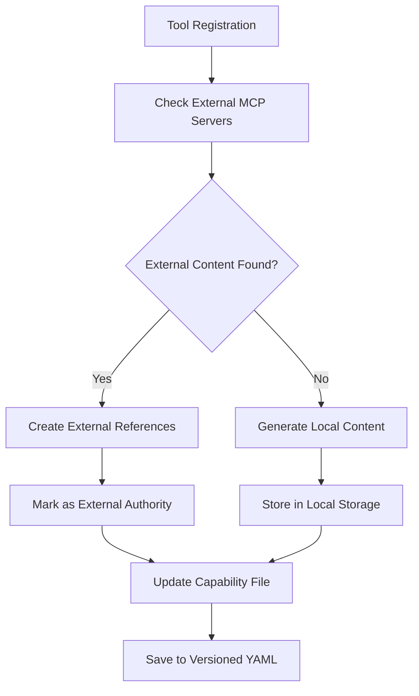

# Prompt & Resource Management System

## Overview

MagicTunnel's Prompt & Resource Management System provides comprehensive handling of MCP prompts and resources with a focus on external MCP server authority and efficient content storage. The system implements a **reference-based architecture** where capability YAML files contain lightweight references that resolve to full content when MCP clients request them.

## Architecture

### Core Principles

1. **YAML References, Full Resolution**: Capability files store references, clients get full content
2. **External Authority**: External MCP servers remain authoritative for their content
3. **Persistent Storage**: Generated content stored with versioning and metadata
4. **Smart Caching**: Intelligent caching prevents repeated external fetches
5. **Seamless Integration**: Works with existing capability file versioning system

### System Components

```
┌─────────────────────────────────────────────────────────────────┐
│                    MCP Client Request                           │
│                  (prompts/list, resources/list)               │
└─────────────────────┬───────────────────────────────────────────┘
                      │
┌─────────────────────▼───────────────────────────────────────────┐
│                Content Resolution Service                       │
│  • Resolves references to full content                        │
│  • Handles external vs. local content                         │
└─────────────────────┬───────────────────────────────────────────┘
                      │
        ┌─────────────┴─────────────┐
        │                           │
┌───────▼────────┐         ┌────────▼──────────┐
│ External MCP   │         │ Local Content     │
│ Content Manager│         │ Storage Service   │
│ • Fetches from │         │ • UUID-based      │
│   external     │         │   storage         │
│ • Caches       │         │ • Versioning      │
│ • Preserves    │         │ • Cleanup         │
│   authority    │         │   policies        │
└───────┬────────┘         └────────┬──────────┘
        │                           │
┌───────▼───────────────────────────▼───────────────────────────┐
│                 Capability YAML Files                        │
│  tool_definition:                                            │
│    prompt_refs:                                              │
│      - name: "usage_prompt"                                  │
│        prompt_type: "usage"                                  │
│        storage_path: "prompts/tool_usage_20250102.json"     │
│        generation_metadata:                                  │
│          external_source: "external_mcp_server"             │
│    resource_refs:                                            │
│      - name: "documentation"                                 │
│        resource_type: "documentation"                       │
│        uri: "docs://tool/documentation"                     │
│        storage_path: "resources/tool_docs_20250102.json"   │
└─────────────────────────────────────────────────────────────┘
```

## Key Features

### 1. Reference-Based Architecture

**Capability Files Store References:**
```yaml
tool_definition:
  name: "example_tool"
  description: "Example tool description"
  prompt_refs:
    - name: "usage_prompt"
      prompt_type: "usage"
      description: "How to use this tool effectively"
      storage_path: "prompts/example_tool_usage_20250102_a1b2c3d4.json"
      generation_metadata:
        model_used: "gpt-4"
        confidence_score: 0.85
        generated_at: "2025-01-02T10:30:00Z"
  resource_refs:
    - name: "documentation"
      resource_type: "documentation" 
      uri: "docs://example_tool/documentation"
      mime_type: "text/markdown"
      storage_path: "resources/example_tool_docs_20250102_e5f6g7h8.json"
```

**MCP Clients Get Full Content:**
```json
{
  "method": "prompts/get",
  "params": {
    "name": "usage_prompt"
  }
}
```

Response:
```json
{
  "result": {
    "name": "usage_prompt",
    "description": "How to use this tool effectively",
    "arguments": [
      {
        "name": "task",
        "description": "The specific task to perform",
        "required": true
      }
    ]
  },
  "messages": [
    {
      "role": "user", 
      "content": {
        "type": "text",
        "text": "Use this tool to {{task}}. Here are the steps..."
      }
    }
  ]
}
```

### 2. External MCP Content Preservation

The system automatically:

1. **Fetches from External Servers**: Checks external MCP servers for existing prompts/resources
2. **Preserves Authority**: External content marked with `external_source` metadata
3. **Prevents Overwriting**: Local generation only occurs if no external content exists
4. **Caches Intelligently**: Avoids repeated fetches with configurable cache policies

**External Content Flow:**


### 3. Content Storage System

**Storage Structure:**
```
storage/generated_content/
├── prompts/
│   ├── tool1_usage_20250102_a1b2c3d4.json
│   ├── tool1_validation_20250102_e5f6g7h8.json
│   └── tool2_troubleshooting_20250102_i9j0k1l2.json
└── resources/
    ├── tool1_docs_20250102_m3n4o5p6.json
    ├── tool1_examples_20250102_q7r8s9t0.json
    └── tool2_schema_20250102_u1v2w3x4.json
```

**Stored Content Format:**
```json
{
  "template": {
    "name": "usage_prompt",
    "description": "How to use this tool effectively",
    "arguments": [...]
  },
  "content": "Full prompt content with examples and instructions...",
  "metadata": {
    "id": "a1b2c3d4-e5f6-g7h8-i9j0-k1l2m3n4o5p6",
    "tool_name": "example_tool",
    "content_type": "prompt",
    "content_subtype": "usage",
    "generation_metadata": {
      "model_used": "gpt-4",
      "confidence_score": 0.85,
      "generated_at": "2025-01-02T10:30:00Z",
      "generation_time_ms": 1500,
      "version": "20250102_103000"
    },
    "stored_at": "2025-01-02T10:30:00Z",
    "version": "20250102_103000",
    "file_path": "prompts/example_tool_usage_20250102_a1b2c3d4.json"
  }
}
```

## Configuration

### Content Storage Configuration

```yaml
content_storage:
  storage_dir: "./storage/generated_content"
  max_storage_mb: 1024  # 1GB limit
  cleanup_policy:
    max_age_days: 90
    max_versions: 10
    cleanup_on_startup: true
  enable_versioning: true
```

### External Content Configuration

```yaml
external_content:
  auto_fetch_enabled: true
  refresh_interval_seconds: 3600  # 1 hour
  cache_external_content: true
  max_cache_age_hours: 24
```

### Prompt Generation Configuration

```yaml
prompt_generation:
  providers:
    - name: "openai"
      provider_type: "OpenAI"
      endpoint: "https://api.openai.com/v1/chat/completions"
      api_key: "${OPENAI_API_KEY}"
      models: ["gpt-4", "gpt-3.5-turbo"]
    - name: "anthropic"
      provider_type: "Anthropic"
      endpoint: "https://api.anthropic.com/v1/messages"
      api_key: "${ANTHROPIC_API_KEY}"
      models: ["claude-3-sonnet-20240229", "claude-3-haiku-20240307"]
  default_model: "gpt-4"
  max_prompts_per_tool: 5
  include_parameter_validation: true
  include_usage_examples: true
  include_troubleshooting: false
```

## API Usage

### Generate Prompts for a Tool

```rust
use magictunnel::mcp::{PromptGeneratorService, PromptGenerationRequest, PromptType};

let request = PromptGenerationRequest {
    tool_name: "example_tool".to_string(),
    tool_definition: tool_def.clone(),
    prompt_types: vec![PromptType::Usage, PromptType::ParameterValidation],
    context: Some("This tool helps with data processing".to_string()),
};

let response = prompt_generator.generate_prompts(request).await?;
println!("Generated {} prompts", response.prompts.len());
```

### Resolve Prompt Reference

```rust
use magictunnel::mcp::ContentStorageService;

let (template, content) = content_storage
    .resolve_prompt(&prompt_ref)
    .await?;

println!("Prompt content: {}", content);
```

### Fetch External Content

```rust
use magictunnel::mcp::ExternalContentManager;

let (prompt_refs, resource_refs) = external_content_manager
    .fetch_external_content_for_tool("example_tool")
    .await?;

println!("Found {} external prompts, {} external resources", 
         prompt_refs.len(), resource_refs.len());
```

## CLI Management

### Content Storage Commands

```bash
# Check storage status
magictunnel content status

# List content for a tool
magictunnel content list --tool example_tool

# Cleanup old content
magictunnel content cleanup --max-age-days 30

# Show storage statistics
magictunnel content stats
```

### External Content Commands

```bash
# Fetch all external content
magictunnel external-content fetch-all

# Update specific tool from external sources
magictunnel external-content update --tool example_tool

# Show cache statistics
magictunnel external-content cache-stats

# Clear external content cache
magictunnel external-content clear-cache
```

### Prompt Generation Commands

```bash
# Generate prompts for a tool
magictunnel prompts generate --tool example_tool --types usage,validation

# List generated prompts
magictunnel prompts list --tool example_tool

# Regenerate prompts (with external MCP warnings)
magictunnel prompts regenerate --tool example_tool --force

# Export prompts
magictunnel prompts export --tool example_tool --format json
```

## Integration with Capability Versioning

The system fully integrates with MagicTunnel's existing capability file versioning:

1. **Automatic Versioning**: When prompts/resources are added, capability files are automatically versioned
2. **Change Tracking**: All prompt/resource reference changes are tracked
3. **Rollback Support**: Can rollback to previous versions of capability files
4. **External Warnings**: CLI warns when potentially overwriting external MCP content

### Version Management Example

```bash
# Show versions for a capability file
magictunnel versions list --server example_server

# Restore a previous version (with prompt/resource preservation)
magictunnel versions restore --server example_server --version 20250101_120000

# Show diff including prompt/resource changes
magictunnel versions diff --server example_server --from 20250101_120000 --to 20250102_103000
```

## Best Practices

### 1. External MCP Content

- **Always check external servers first** before generating local content
- **Respect external authority** - don't override external prompts/resources
- **Use caching wisely** - configure appropriate cache policies for your use case
- **Monitor external sources** - set up alerts for external MCP server issues

### 2. Content Storage

- **Set appropriate cleanup policies** to manage storage growth
- **Use versioning** for rollback capabilities
- **Monitor storage usage** and adjust limits as needed
- **Regular cleanup** of old content to maintain performance

### 3. Generation Configuration

- **Choose appropriate models** for your use case and budget
- **Set reasonable limits** on generated content
- **Configure timeouts** for LLM API calls
- **Use fallback providers** for reliability

### 4. Performance Optimization

- **Enable caching** for external content
- **Use pre-generation** at startup for better response times
- **Monitor generation times** and adjust models if needed
- **Implement proper cleanup** to prevent storage bloat

## Troubleshooting

### Common Issues

**External Content Not Found:**
```bash
# Check external MCP server connectivity
magictunnel external-mcp status

# Verify tool exists in external server
magictunnel external-mcp tools --server example_server

# Force refresh external content
magictunnel external-content fetch-all --force
```

**Storage Issues:**
```bash
# Check storage health
magictunnel content status --verbose

# Verify file permissions
ls -la storage/generated_content/

# Clean up corrupted files
magictunnel content cleanup --verify
```

**Generation Failures:**
```bash
# Check LLM provider status
magictunnel providers status

# Test generation with debug logging
RUST_LOG=debug magictunnel prompts generate --tool test_tool

# Verify API keys and endpoints
magictunnel config validate --section prompt_generation
```

## Future Enhancements

1. **UI Management Interface**: Web-based prompt/resource management
2. **Advanced Caching**: Redis/distributed caching for multi-instance deployments
3. **Content Templates**: Reusable templates for common prompt patterns
4. **Analytics Dashboard**: Usage analytics and generation metrics
5. **Collaborative Editing**: Multi-user prompt/resource editing with conflict resolution
6. **Content Marketplace**: Sharing and discovering prompts/resources across organizations

---

*This system represents a major advancement in MCP content management, providing enterprise-grade features while maintaining simplicity and reliability.*